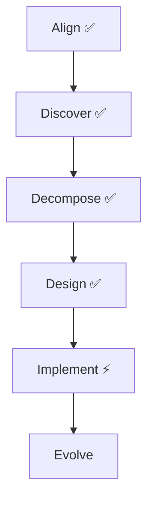

# Effect プロジェクト ドキュメント

## 概要

Effect は英語語彙学習プラットフォームです。このドキュメントは Domain-Driven Design (DDD) のプロセスに従って整理されています。

- **ビジネス目的**: 英語学習者向けの語彙学習支援（IELTS、TOEFL 等の試験対策）
- **アーキテクチャ学習**: DDD、マイクロサービス、イベントソーシング、CQRS、ヘキサゴナルアーキテクチャ、Saga パターン

## ドキュメント構成

### 📋 [戦略的設計](./strategic/) - ビジネス視点の設計

- [domain-vision.md](./strategic/domain-vision.md) - ドメインビジョンとビジネス目標
- [bounded-contexts.md](./strategic/bounded-contexts.md) - 6つの境界づけられたコンテキスト
- [context-map.md](./strategic/context-map.md) - コンテキスト間の関係性
- [ubiquitous-language.md](./strategic/ubiquitous-language.md) - ユビキタス言語辞書
- [domain-classification.md](./strategic/domain-classification.md) - Core/Supporting/Generic ドメイン分類

### 🔧 [戦術的設計](./tactical/) - 技術視点の設計

- [aggregate-design-overview.md](./tactical/aggregate-design-overview.md) - 全体の集約設計
- **shared/** - 共有コンポーネント
  - [overview.md](./tactical/shared/overview.md) - 概要
  - [kernel.md](./tactical/shared/kernel.md) - 共有カーネル
  - [infrastructure.md](./tactical/shared/infrastructure.md) - 共有インフラストラクチャ
  - [cross-cutting-concerns.md](./tactical/shared/cross-cutting-concerns.md) - 横断的関心事
- **contexts/** - 各 Bounded Context の詳細設計
  - vocabulary/ - 語彙管理コンテキスト
  - learning/ - 学習コンテキスト
  - progress/ - 進捗管理コンテキスト
  - ai-integration/ - AI 統合コンテキスト
  - user/ - ユーザー管理コンテキスト
  - learning-algorithm/ - 学習アルゴリズムコンテキスト
- **integration/** - コンテキスト間統合
  - [patterns.md](./tactical/integration/patterns.md) - 統合パターン
  - [saga-design.md](./tactical/integration/saga-design.md) - Saga パターン設計
  - [event-flows.md](./tactical/integration/event-flows.md) - クロスコンテキストイベント

### 🔍 [発見フェーズ](./discovery/) - ドメイン理解の成果物

- **event-storming/** - イベントストーミング
  - [big-picture.md](./discovery/event-storming/big-picture.md) - ビッグピクチャー

### 📝 [アーキテクチャ決定記録](./decisions/) - 重要な技術決定

- [adr-001-cqrs-event-sourcing-adoption.md](./decisions/adr-001-cqrs-event-sourcing-adoption.md)
- [adr-002-service-decomposition-strategy.md](./decisions/adr-002-service-decomposition-strategy.md)
- [adr-003-event-store-and-event-bus-selection.md](./decisions/adr-003-event-store-and-event-bus-selection.md)

### 📚 [ガイドライン](./guidelines/) - 実装ガイドライン

- 開発標準とベストプラクティス（準備中）

## 各 Bounded Context の概要

### 1. Vocabulary Context（語彙管理）

- **責務**: グローバル辞書の管理、項目の CRUD 操作
- **設計**: Event Sourcing、楽観的ロック、AI 連携

### 2. Learning Context（学習）

- **責務**: 学習セッション管理、問題出題、結果記録
- **設計**: ハイブリッド UI フロー、項目選定戦略

### 3. Progress Context（進捗管理）

- **責務**: 学習進捗の追跡、統計分析、達成度管理
- **設計**: 純粋な CQRS/Event Sourcing

### 4. AI Integration Context（AI 統合）

- **責務**: AI サービスとの連携、コンテンツ生成
- **設計**: 非同期処理、Anti-Corruption Layer

### 5. User Context（ユーザー管理）

- **責務**: 認証・認可、プロフィール管理
- **設計**: Firebase Auth 統合、シンプルな権限管理

### 6. Learning Algorithm Context（学習アルゴリズム）

- **責務**: SM-2 アルゴリズム実装、学習最適化
- **設計**: 科学的アプローチ、85% ルール

## DDD プロセスの進捗

## 重要な設計決定

- **用語統一**: 「語句」→「項目（Item）」
- **マイクロサービス**: 最初から分離（Rust + cargo workspace）
- **イベントストア**: PostgreSQL + カスタム実装
- **メッセージング**: Google Pub/Sub
- **API Gateway**: GraphQL (async-graphql)
- **認証**: Firebase Auth + Google OAuth のみ

## ナビゲーション

### 初めての方へ

1. [戦略的設計](./strategic/) から全体像を把握
2. [発見フェーズ](./discovery/) でドメイン理解を深める
3. [戦術的設計](./tactical/) で技術的な詳細を確認

### 実装者の方へ

1. [アーキテクチャ決定記録](./decisions/) で技術選定の根拠を確認
2. [戦術的設計](./tactical/) で各コンテキストの設計を確認
3. [ガイドライン](./guidelines/) で実装標準を確認

## 関連リンク

- [プロジェクト進捗サマリー](./ddd/progress-summary.md) - 詳細な進捗状況（旧構造）
- [DDD-Crew: DDD Starter Modelling Process](https://ddd-crew.github.io/ddd-starter-modelling-process/)
