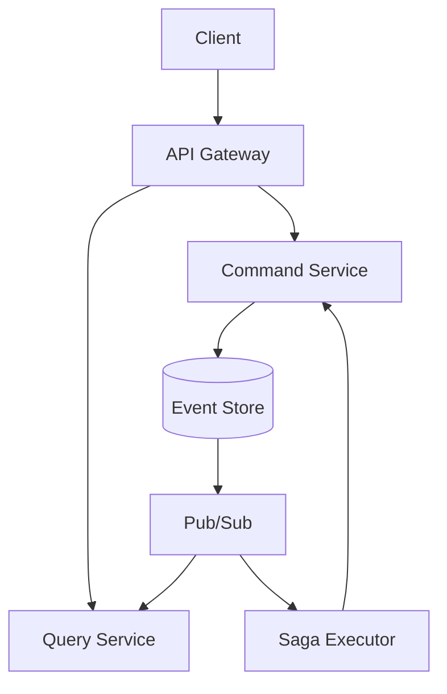

# マイクロサービス設計

## サービス間通信

### 通信方式の使い分け

| 通信方式 | 用途 | 使用場面 |
|---------|------|----------|
| gRPC | 同期的RPC | コマンド実行、即座の応答が必要な場合 |
| Pub/Sub | 非同期メッセージング | イベント配信、疎結合通信 |
| GraphQL | クライアント通信 | フロントエンドとの通信 |

### gRPC 定義

```protobuf
// proto/command_service.proto
syntax = "proto3";

package effect.command;

service CommandService {
    rpc ExecuteCommand(CommandRequest) returns (CommandResponse);
    rpc GetCommandStatus(CommandStatusRequest) returns (CommandStatusResponse);
}

message CommandRequest {
    string command_type = 1;
    bytes payload = 2;
    string correlation_id = 3;
}

message CommandResponse {
    bool success = 1;
    string aggregate_id = 2;
    int64 version = 3;
    string error_message = 4;
}
```

### Pub/Sub トピック設計

```yaml
topics:
  # ドメインイベント
  - name: domain-events
    subscriptions:
      - query-service-projection
      - saga-executor
      - analytics-service

  # Saga イベント
  - name: saga-events
    subscriptions:
      - saga-executor

  # システムイベント
  - name: system-events
    subscriptions:
      - monitoring-service
```

## サービス詳細設計

### API Gateway

```rust
// services/api-gateway/src/main.rs
use async_graphql::{Schema, Object, Context};
use axum::{Router, Extension};

pub struct QueryRoot;

#[Object]
impl QueryRoot {
    async fn word(&self, ctx: &Context<'_>, id: Uuid) -> Result<Word> {
        let query_client = ctx.data::<QueryServiceClient>()?;
        query_client.get_word(id).await
    }

    async fn learning_session(&self, ctx: &Context<'_>, id: Uuid) -> Result<Session> {
        let query_client = ctx.data::<QueryServiceClient>()?;
        query_client.get_session(id).await
    }
}

pub struct MutationRoot;

#[Object]
impl MutationRoot {
    async fn create_word(&self, ctx: &Context<'_>, input: CreateWordInput) -> Result<Word> {
        let command_client = ctx.data::<CommandServiceClient>()?;
        let command = CreateWordCommand::from(input);
        command_client.execute(command).await
    }

    async fn start_session(&self, ctx: &Context<'_>, input: StartSessionInput) -> Result<Session> {
        let command_client = ctx.data::<CommandServiceClient>()?;
        let command = StartSessionCommand::from(input);
        command_client.execute(command).await
    }
}
```

### Command Service

```rust
// services/command-service/src/domain/aggregates/word.rs
pub struct WordAggregate {
    id: Uuid,
    state: WordState,
    version: i64,
    pending_events: Vec<DomainEvent>,
}

impl WordAggregate {
    pub fn create(command: CreateWordCommand) -> Result<Self> {
        // ビジネスルールの検証
        if command.text.is_empty() {
            return Err(DomainError::InvalidWord);
        }

        let event = WordCreated {
            word_id: Uuid::new_v4(),
            text: command.text,
            meaning: command.meaning,
            difficulty: command.difficulty,
        };

        let mut aggregate = Self::new();
        aggregate.apply(event.into());
        Ok(aggregate)
    }

    pub fn update(&mut self, command: UpdateWordCommand) -> Result<()> {
        // 更新ロジック
        let event = WordUpdated {
            word_id: self.id,
            changes: command.changes,
        };

        self.apply(event.into());
        Ok(())
    }

    fn apply(&mut self, event: DomainEvent) {
        match event {
            DomainEvent::WordCreated(e) => {
                self.state = WordState::Active;
                self.id = e.word_id;
            }
            DomainEvent::WordUpdated(e) => {
                // 状態更新
            }
            _ => {}
        }

        self.pending_events.push(event);
        self.version += 1;
    }
}
```

### Query Service

```rust
// services/query-service/src/projections/word_projection.rs
pub struct WordProjection {
    repository: Arc<dyn WordReadRepository>,
}

#[async_trait]
impl EventHandler for WordProjection {
    async fn handle(&self, event: DomainEvent) -> Result<()> {
        match event {
            DomainEvent::WordCreated(e) => {
                let word = WordReadModel {
                    id: e.word_id,
                    text: e.text,
                    meaning: e.meaning,
                    difficulty: e.difficulty,
                    created_at: event.metadata.timestamp,
                };
                self.repository.save(word).await?;
            }
            DomainEvent::WordUpdated(e) => {
                self.repository.update(e.word_id, e.changes).await?;
            }
            _ => {}
        }
        Ok(())
    }
}
```

### Saga Executor

```rust
// services/saga-executor/src/sagas/learning_saga.rs
pub struct LearningSaga {
    command_client: Arc<CommandServiceClient>,
}

#[async_trait]
impl Saga for LearningSaga {
    async fn handle(&self, event: DomainEvent) -> Result<Vec<SagaCommand>> {
        match event {
            DomainEvent::SessionCompleted(e) => {
                // 学習完了後の処理
                let commands = vec![
                    SagaCommand::UpdateProgress {
                        user_id: e.user_id,
                        session_id: e.session_id,
                    },
                    SagaCommand::CheckStreak {
                        user_id: e.user_id,
                    },
                ];
                Ok(commands)
            }
            _ => Ok(vec![]),
        }
    }

    async fn compensate(&self, failed_command: &SagaCommand) -> Result<()> {
        // 補償トランザクション
        match failed_command {
            SagaCommand::UpdateProgress { .. } => {
                // ロールバック処理
            }
            _ => {}
        }
        Ok(())
    }
}
```

## サービス間の依存関係



## 共有ライブラリの活用

### shared/domain

- ドメインイベント定義
- 値オブジェクト
- ドメインエラー

### shared/infrastructure

- Event Store インターフェース
- Pub/Sub アダプター
- gRPC クライアント

### shared/cqrs

- コマンド・クエリ基底型
- ディスパッチャー
