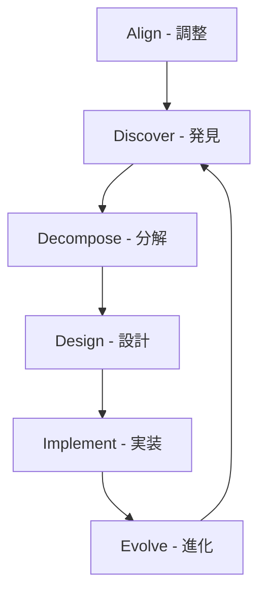

# Domain-Driven Design (DDD) ドキュメント

## 概要

このディレクトリには、Effect プロジェクトの Domain-Driven Design プロセスに関するドキュメントが含まれています。
[DDD-Crew の DDD Starter Modelling Process](https://ddd-crew.github.io/ddd-starter-modelling-process/) に基づいて進めています。

## プロジェクトの背景

Effect は、英単語学習アプリケーションです。学習者（主に開発者自身）が：

- IELTS/TOEIC/TOEFL などの試験対策
- 科学的な学習方法（SM-2 アルゴリズム）による効率的な記憶定着
- 協調的な単語管理による学習コンテンツの充実

これらを実現しながら、DDD の実践的な学習も行います。

## ドキュメント構造

### 1. [プロセス記録](./process.md)

DDD 実践の進捗と学習内容を記録

### 2. 戦略的設計 (Strategic Design)

- [ドメインビジョン](./strategic/domain-vision.md) - ビジネス目標と成功の定義
- [ドメインタイプ](./strategic/domain-types.md) - コアドメイン、サブドメインの分類
- [コンテキストマップ](./strategic/context-map.md) - 境界づけられたコンテキストの関係
- [統合パターン](./strategic/integration-patterns.md) - コンテキスト間の統合方法

### 3. 発見フェーズ (Discovery)

- イベントストーミング
  - [ビッグピクチャー](./discovery/event-storming/big-picture.md) - 全体像の把握
  - [デザインレベル](./discovery/event-storming/design-level.md) - 詳細設計
- [ユビキタス言語](./discovery/ubiquitous-language.md) - ドメイン用語辞書
- [ドメインストーリー](./discovery/domain-stories.md) - ユーザージャーニー

### 4. 戦術的設計 (Tactical Design)

- [集約](./tactical/aggregates.md) - アグリゲートの設計
- [値オブジェクト](./tactical/value-objects.md) - 値オブジェクトのカタログ
- [ドメインサービス](./tactical/domain-services.md) - ドメインサービスの定義
- [ドメインイベント](./tactical/domain-events.md) - イベントのカタログ

## DDD プロセスの流れ

### Phase 1: Align（調整）

- ビジネス目標の明確化
- ステークホルダーの特定
- 成功の定義

### Phase 2: Discover（発見）

- EventStorming Big Picture
- ドメインの探索
- ユビキタス言語の構築

### Phase 3: Decompose（分解）

- 境界づけられたコンテキストの特定
- コンテキストマップの作成
- チーム構造の検討

### Phase 4: Design（設計）

- EventStorming Design Level
- 集約の設計
- ドメインモデリング

### Phase 5: Implement（実装）

- テスト駆動開発
- 継続的リファクタリング
- ドメイン知識の深化

### Phase 6: Evolve（進化）

- フィードバックループ
- モデルの改善
- 新たな発見

## 主要な概念

### ドメインエキスパート

- **主要**: 開発者自身（英語学習者として）
- **補助**: AI アシスタント（技術的観点）
- **仮想**: IELTS 7.0 を目指す社会人ペルソナ

### コアドメイン

- 学習最適化アルゴリズム（SM-2）
- 個人に最適化された学習体験

### サポーティングサブドメイン

- 単語管理
- 進捗追跡
- 統計分析

### ジェネリックサブドメイン

- ユーザー認証
- 通知
- ファイル管理

## 参考資料

- [DDD-Crew: DDD Starter Modelling Process](https://ddd-crew.github.io/ddd-starter-modelling-process/)
- [Domain-Driven Design (Eric Evans)](https://www.dddcommunity.org/book/evans_2003/)
- [Implementing Domain-Driven Design (Vaughn Vernon)](https://www.amazon.com/dp/0321834577)
- [Event Storming (Alberto Brandolini)](https://www.eventstorming.com/)

## 進め方

1. このドキュメントを起点として、各フェーズを順番に進めます
2. 各ステップで発見した内容を該当するドキュメントに記録します
3. AI アシスタントとの対話を通じて、ドメイン知識を深めていきます
4. 実装と並行して、ドキュメントを継続的に更新します
