# Domain-Driven Design (DDD) ドキュメント

## 概要

このディレクトリには、Effect プロジェクトの Domain-Driven Design プロセスに関するドキュメントが含まれています。
[DDD-Crew の DDD Starter Modelling Process](https://ddd-crew.github.io/ddd-starter-modelling-process/) に基づいて進めています。

## プロジェクトの背景

Effect は、英語語彙学習プラットフォームです（試験対策：IELTS、TOEFL 等）。主な目的：

- **真の目的**: アーキテクチャ学習（DDD、マイクロサービス、イベントソーシング、CQRS、ヘキサゴナルアーキテクチャ、Saga パターン）
- **ユーザー**: 開発者本人と家族数名（学習デモアプリ）
- **方針**: 対話を通じて少しずつ確実に進める

## 現在のドキュメント構造

### [進捗サマリー](./progress-summary.md) ⭐

現在の進捗状況と再開時のガイド（最初に読むべきドキュメント）

### 戦略的設計 (Strategic Design)

- [ドメインビジョン](./strategic/domain-vision.md) - ビジネス目標と成功の定義
- [境界づけられたコンテキスト](./strategic/bounded-contexts.md) - 6 つのコンテキストの定義
- [コンテキストマップ](./strategic/context-map.md) - コンテキスト間の関係
- [統合パターン](./strategic/integration-patterns.md) - コンテキスト間の統合方法

### 発見フェーズ (Discovery)

- [イベントストーミング - ビッグピクチャー](./discovery/event-storming/big-picture.md) - 全体像の把握
- [ユビキタス言語](./discovery/ubiquitous-language.md) - ドメイン用語辞書

### 詳細設計 (Design)

#### EventStorming Design Level（各コンテキスト）

- [Learning Context](./design/event-storming-design-level/learning-context.md)
- [Vocabulary Context](./design/event-storming-design-level/vocabulary-context.md)
- [Learning Algorithm Context](./design/event-storming-design-level/learning-algorithm-context.md)
- [Progress Context](./design/event-storming-design-level/progress-context.md)
- [AI Integration Context](./design/event-storming-design-level/ai-integration-context.md)
- [User Context](./design/event-storming-design-level/user-context.md)

#### 集約設計

- [集約の特定と境界](./design/aggregate-identification.md) - 全集約の整理と分析
- [集約の可視化](./design/aggregates/) - PlantUML 図（overview、relationships、event-flow）

#### リポジトリ設計

- [リポジトリ設計概要](./design/repositories/repository-design-overview.md) - 設計原則と共通インターフェース
- 各コンテキストのリポジトリ設計（[repositories/](./design/repositories/) ディレクトリ参照）

#### Bounded Context Canvas

- [Canvas テンプレート](./design/bounded-context-canvas/template.md) - DDD-Crew ベース、日本語説明付き
- [Learning Context Canvas](./design/bounded-context-canvas/learning-context.md) - 作成済み

#### その他の設計ドキュメント

- [イベント整合性分析](./design/event-consistency-analysis.md) - イベント命名規則の統一
- [Progress Context プロジェクション設計](./design/projections/progress-context-projection-mapping.md) - GraphQL マッピング
- [Saga パターンの使用機会](./design/saga-pattern-opportunities.md) - 分散トランザクション管理

## 確定した 6 つのコンテキスト

1. **Learning Context（学習）** - 学習セッション管理
2. **Vocabulary Context（語彙管理）** - 語彙エントリの管理
3. **Learning Algorithm Context（学習アルゴリズム）** - SM-2 アルゴリズム実装
4. **Progress Context（進捗）** - CQRS/イベントソーシング
5. **AI Integration Context（AI 統合）** - AI 生成と深掘り
6. **User Context（ユーザー）** - 認証と権限管理

## DDD プロセスの進捗

```mermaid
graph TD
    A[Align - 調整 ✅] --> B[Discover - 発見 ✅]
    B --> C[Decompose - 分解 ✅]
    C --> D[Design - 設計 ⚡進行中]
    D --> E[Implement - 実装]
    E --> F[Evolve - 進化]
    F --> B
```

### 完了フェーズ

- ✅ Phase 1: Align - ビジネス目標の明確化
- ✅ Phase 2: Discover - EventStorming Big Picture、ユビキタス言語
- ✅ Phase 3: Decompose - 境界づけられたコンテキストの特定
- ✅ Phase 4: Design - EventStorming Design Level（全コンテキスト）
- ✅ Phase 4: Design - 集約の特定と可視化
- ✅ Phase 4: Design - リポジトリ設計（全コンテキスト）
- ✅ Phase 4: Design - 既存成果の改善（戦略的分類、イベント整合性、プロジェクション設計）

### 現在の作業

- ⚡ Phase 4: Design - Bounded Context Canvas（Learning Context 完了、残り 5 コンテキスト）
- 📋 Phase 4: Design - ドメインサービスの設計（必要に応じて）
- 📋 Phase 5: Implementation - 技術選定と設計

## 重要な決定事項

- **用語統一**: 「語句」→「項目（Item）」
- **認証**: Firebase Auth + Google OAuth のみ
- **通知機能**: 実装しない
- **UI**: 日本語固定、タイムゾーン JST 固定
- **テスト**: 1 セッション最大 100 問（設定可能）、約 25 分
- **対応試験**: IELTS、TOEFL 等（IELTS だけに特化しない）
- **マイクロサービス**: 最初から分離（cargo workspace monorepo）
- **ItemsSelected**: 同期通信（UX 優先の設計判断）
- **Saga パターン**: AI 生成タスクの補償処理から実装予定

## アーカイブ

古いドキュメントは [`docs/archive/ddd/`](./../archive/ddd/) フォルダに移動しました。

## 参考資料

- [DDD-Crew: DDD Starter Modelling Process](https://ddd-crew.github.io/ddd-starter-modelling-process/)
- [Domain-Driven Design (Eric Evans)](https://www.dddcommunity.org/book/evans_2003/)
- [Implementing Domain-Driven Design (Vaughn Vernon)](https://www.amazon.com/dp/0321834577)
- [Event Storming (Alberto Brandolini)](https://www.eventstorming.com/)
