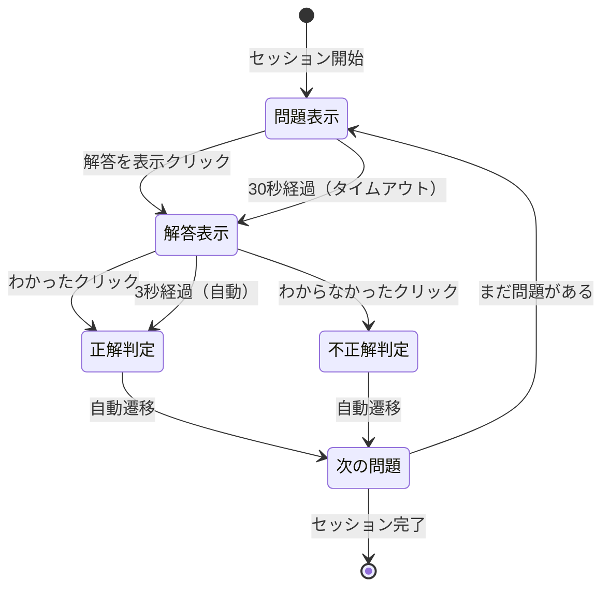
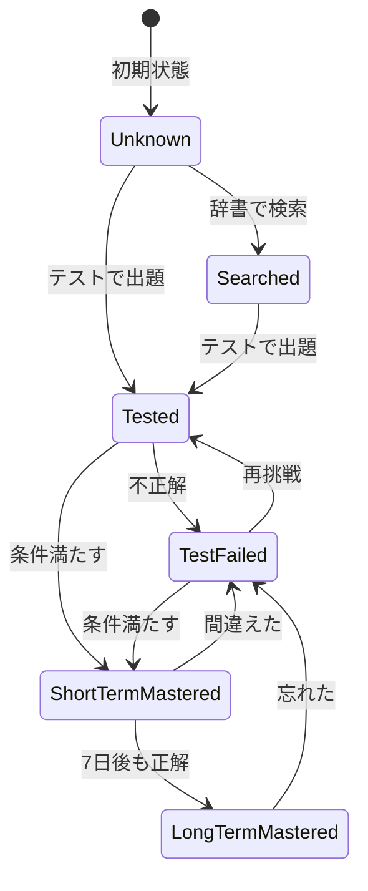

# Learning Context - EventStorming Design Level

## 概要

Learning Context は、Effect プロジェクトの中核となるコンテキストで、学習セッションの管理、テストの実施、ユーザーの反応記録、「覚えた」状態の判定を担当します。

### 主要な責務

- 25分のポモドーロ単位での学習セッション管理
- 項目の提示と反応時間の記録
- 正誤判定と学習状態の追跡
- 他コンテキストとの連携（Vocabulary、AI Integration、Learning Algorithm）

## 集約の設計

### 1. LearningSession（学習セッション）- 集約ルート

学習セッション全体を管理する集約です。1回のテストセッション（最大10問）の状態を保持します。

```rust
pub struct LearningSession {
    session_id: SessionId,
    user_id: UserId,
    started_at: Option<DateTime<Utc>>,
    items: Vec<SessionItem>,
    status: SessionStatus,
    session_type: SessionType,
}

pub enum SessionStatus {
    NotStarted,
    InProgress,
    Completed,
}

pub enum SessionType {
    Review,      // 復習セッション
    NewItems,    // 新規学習セッション
    Mixed,       // 混合セッション
}
```

### 2. SessionItem（セッション項目）- 値オブジェクト

セッション内の個々の問題を表現します。

```rust
pub struct SessionItem {
    item_id: ItemId,
    presented_at: Option<DateTime<Utc>>,
    answer_revealed_at: Option<DateTime<Utc>>,
    response_time_ms: Option<u32>,
    answer_reveal_trigger: Option<AnswerRevealTrigger>,
    correctness_judgment: Option<CorrectnessJudgment>,
}

pub enum AnswerRevealTrigger {
    UserRequested { elapsed_time_ms: u32 },
    TimeLimit,
}

pub enum CorrectnessJudgment {
    AutoConfirmed,           // 自動で正解扱い（3秒経過）
    UserConfirmedCorrect,    // ユーザーが明示的に「わかった」と確認
    UserConfirmedIncorrect,  // ユーザーが「わからなかった」と申告
}
```

### 3. UserItemRecord（ユーザー項目記録）- 別の集約

ユーザーと項目の学習履歴を永続的に管理します。

```rust
pub struct UserItemRecord {
    user_id: UserId,
    item_id: ItemId,
    mastery_status: MasteryStatus,
    response_history: Vec<ResponseRecord>,
    last_reviewed: DateTime<Utc>,
    created_at: DateTime<Utc>,
}

pub enum MasteryStatus {
    Unknown,                    // 未知（まだ見たことない）
    Searched,                   // 検索済み（辞書で見た）
    Tested,                     // テスト済み（正答率低い）
    TestFailed,                 // テスト不正解（直近で間違えた）
    ShortTermMastered {         // 短期記憶で覚えた
        mastered_at: DateTime<Utc>,
        consecutive_correct: u32,
    },
    LongTermMastered {          // 長期記憶で覚えた
        mastered_at: DateTime<Utc>,
        retention_days: u32,
    },
}

pub struct ResponseRecord {
    responded_at: DateTime<Utc>,
    response_time_ms: u32,
    judgment: CorrectnessJudgment,
    session_id: SessionId,
}
```

## コマンドとイベント

### コマンド（青い付箋 🟦）

```rust
pub enum LearningCommand {
    StartSession {
        user_id: UserId,
        item_ids: Vec<ItemId>,
        session_type: SessionType,
    },
    
    PresentItem {
        session_id: SessionId,
        item_id: ItemId,
    },
    
    RequestAnswer {
        session_id: SessionId,
        item_id: ItemId,
        elapsed_time_ms: u32,
    },
    
    JudgeCorrectness {
        session_id: SessionId,
        item_id: ItemId,
        judgment: CorrectnessJudgment,
    },
    
    CompleteSession {
        session_id: SessionId,
    },
}
```

### ドメインイベント（オレンジの付箋 🟠）

```rust
pub enum LearningDomainEvent {
    SessionStarted {
        event_id: EventId,
        occurred_at: DateTime<Utc>,
        session_id: SessionId,
        user_id: UserId,
        item_count: usize,
    },
    
    ItemPresented {
        event_id: EventId,
        occurred_at: DateTime<Utc>,
        session_id: SessionId,
        item_id: ItemId,
        time_limit: Duration,
    },
    
    AnswerRevealed {
        event_id: EventId,
        occurred_at: DateTime<Utc>,
        session_id: SessionId,
        item_id: ItemId,
        trigger: AnswerRevealTrigger,
    },
    
    CorrectnessJudged {
        event_id: EventId,
        occurred_at: DateTime<Utc>,
        session_id: SessionId,
        item_id: ItemId,
        judgment: CorrectnessJudgment,
    },
    
    SessionCompleted {
        event_id: EventId,
        occurred_at: DateTime<Utc>,
        session_id: SessionId,
        total_items: usize,
        correct_count: usize,
    },
    
    ItemMasteryUpdated {
        event_id: EventId,
        occurred_at: DateTime<Utc>,
        user_id: UserId,
        item_id: ItemId,
        old_status: MasteryStatus,
        new_status: MasteryStatus,
    },
}
```

## UI/UX フロー

### ハイブリッド方式の採用

ユーザー負担を最小限にしながら、正確な学習記録を取るため、以下のフローを採用：

```
1. 問題表示（30秒カウントダウン）
   └─ [解答を表示] ボタン

2. 解答表示（3秒カウントダウン）
   ├─ [わかった] ボタン
   ├─ [わからなかった] ボタン
   └─ （3秒経過で自動的に「わかった」扱い）

3. 次の問題へ自動遷移
```

### フロー図



## ビジネスポリシー（紫の付箋 🟪）

### 自動進行ポリシー

```rust
// 解答表示後、3秒間ユーザーのアクションを待つ
when AnswerRevealedEvent && trigger == UserRequested {
    schedule_after(3.seconds) {
        if !user_action_received {
            emit JudgeCorrectnessCommand(AutoConfirmed)
        }
    }
}
```

### 正答判定ポリシー

```rust
// 正答・不正答の判定ロジック
when CorrectnessJudgedEvent {
    match (answer_reveal_trigger, judgment) {
        // ユーザーが自発的に解答表示 → わかった/自動 = 正解
        (UserRequested, UserConfirmedCorrect) => mark_as_correct(),
        (UserRequested, AutoConfirmed) => mark_as_correct(),
        
        // わからなかった = 不正解
        (_, UserConfirmedIncorrect) => mark_as_incorrect(),
        
        // 時間切れ = 不正解（そもそも解答を思い出せなかった）
        (TimeLimit, _) => mark_as_incorrect(),
    }
}
```

### 短期記憶マスター判定ポリシー

```rust
// 3回連続正解かつ平均反応時間3秒以内
fn should_mark_short_term_mastered(record: &UserItemRecord) -> bool {
    let recent_responses = record.last_n_responses(3);
    
    recent_responses.len() == 3 &&
    recent_responses.iter().all(|r| r.is_correct()) &&
    recent_responses.iter().map(|r| r.response_time_ms).sum::<u32>() / 3 < 3000
}
```

### 長期記憶マスター判定ポリシー

```rust
// 短期記憶マスターから7日以上経過かつ再テストで正解
fn should_mark_long_term_mastered(record: &UserItemRecord) -> bool {
    match &record.mastery_status {
        MasteryStatus::ShortTermMastered { mastered_at, .. } => {
            let days_elapsed = (Utc::now() - *mastered_at).num_days();
            days_elapsed >= 7 && record.last_response_is_correct()
        }
        _ => false,
    }
}
```

### セッション完了ポリシー

```rust
when all_items_completed || session_timeout_reached {
    emit CompleteSessionCommand
}
```

## 状態遷移

### MasteryStatus の状態遷移



## リードモデル（緑の付箋 🟩）

### CurrentSessionView（現在のセッション状態）

```rust
pub struct CurrentSessionView {
    session_id: SessionId,
    current_item_index: usize,
    total_items: usize,
    elapsed_time: Duration,
    remaining_time: Duration,
    current_item: Option<CurrentItemView>,
}

pub struct CurrentItemView {
    item_id: ItemId,
    spelling: String,
    time_remaining: Duration,
    answer_revealed: bool,
    judgment: Option<CorrectnessJudgment>,
}
```

### SessionResultView（セッション結果サマリー）

```rust
pub struct SessionResultView {
    session_id: SessionId,
    completed_at: DateTime<Utc>,
    duration: Duration,
    total_items: usize,
    correct_count: usize,
    incorrect_count: usize,
    average_response_time: Duration,
    mastery_updates: Vec<MasteryUpdateView>,
}

pub struct MasteryUpdateView {
    item_id: ItemId,
    spelling: String,
    old_status: MasteryStatus,
    new_status: MasteryStatus,
}
```

## 集約の実装例

```rust
impl LearningSession {
    // コマンドハンドラー
    pub fn start(user_id: UserId, items: Vec<ItemId>) -> Result<(Self, Vec<DomainEvent>)> {
        // ビジネスルール：1-20問の範囲
        if items.is_empty() || items.len() > 20 {
            return Err(DomainError::InvalidItemCount);
        }
        
        let session = Self {
            session_id: SessionId::new(),
            user_id,
            items: items.into_iter().map(SessionItem::new).collect(),
            status: SessionStatus::NotStarted,
            started_at: None,
            session_type: SessionType::Review,
        };
        
        let event = DomainEvent::SessionStarted {
            event_id: EventId::new(),
            occurred_at: Utc::now(),
            session_id: session.session_id,
            user_id,
            item_count: session.items.len(),
        };
        
        Ok((session, vec![event]))
    }
    
    pub fn request_answer(&mut self, item_id: ItemId, elapsed_time_ms: u32) 
        -> Result<Vec<DomainEvent>> {
        // 現在の項目を取得
        let current_item = self.get_current_item_mut()?;
        
        // ビジネスルール：同じ項目に対して複数回の解答要求は不可
        if current_item.answer_revealed_at.is_some() {
            return Err(DomainError::AnswerAlreadyRevealed);
        }
        
        current_item.answer_revealed_at = Some(Utc::now());
        current_item.response_time_ms = Some(elapsed_time_ms);
        current_item.answer_reveal_trigger = Some(
            AnswerRevealTrigger::UserRequested { elapsed_time_ms }
        );
        
        let event = DomainEvent::AnswerRevealed {
            event_id: EventId::new(),
            occurred_at: Utc::now(),
            session_id: self.session_id,
            item_id,
            trigger: AnswerRevealTrigger::UserRequested { elapsed_time_ms },
        };
        
        Ok(vec![event])
    }
}
```

## 他コンテキストとの連携

### Vocabulary Context との連携

- テスト項目の情報取得（同期API）
- 項目の詳細情報（spelling, definitions など）

### AI Integration Context との連携

- テストカスタマイズ要求（非同期API）
- 深掘りチャット機能への遷移

### Learning Algorithm Context との連携

- テスト結果の送信（イベント駆動）
- 次回復習日の取得（同期API）

### Progress Context との連携

- 学習完了イベントの発行
- 統計情報の更新通知

## 今後の検討事項

1. **パフォーマンス最適化**
   - 大量の学習履歴データの効率的な管理
   - リードモデルのキャッシュ戦略

2. **エラーハンドリング**
   - ネットワーク障害時の対応
   - 部分的なデータ保存の実装

3. **拡張性**
   - 新しい学習モード（リスニング、スピーキング）への対応
   - より高度な判定アルゴリズムの導入

## 更新履歴

- 2025-07-27: 初版作成（ユーザーとの対話に基づく詳細設計）
