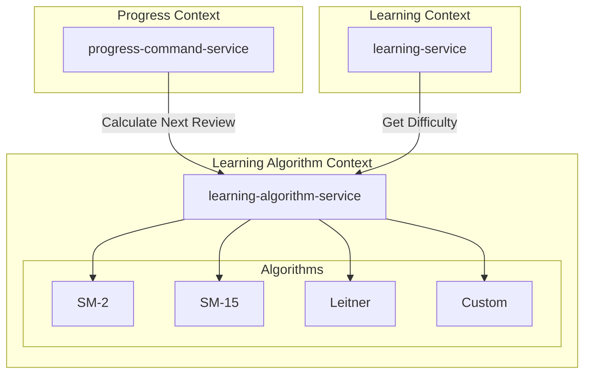

# Learning Algorithm Context サービス分解設計

## 概要

Learning Algorithm Context は、SM-2 アルゴリズムとその他の学習アルゴリズムの実装を担当する専門的なコンテキストです。Progress Context から分離することで、アルゴリズムの進化と最適化を独立して行えます。ステートレスな計算サービスとして設計され、高い可用性とスケーラビリティを実現します。

## 責務

1. **SM-2 アルゴリズムの実装**
   - 標準 SM-2 アルゴリズムの計算
   - パラメータのカスタマイズ
   - バリエーションの提供

2. **アルゴリズムの最適化**
   - ユーザー別パラメータ調整
   - 学習パターンに基づく改善
   - A/B テストのサポート

3. **他アルゴリズムの実装**
   - SM-15 アルゴリズム
   - Leitner システム
   - カスタムアルゴリズム

4. **分析と推奨**
   - 最適なアルゴリズムの推奨
   - パフォーマンス分析
   - 学習効率の予測

## アーキテクチャ

### サービス構成

```
learning-algorithm-context/
└── learning-algorithm-service    # アルゴリズム計算サービス（ステートレス）
```

### サービス特性

- **ステートレス**: 状態を持たない純粋な計算サービス
- **高可用性**: 複数インスタンスでの水平スケーリング
- **低レイテンシ**: インメモリ計算で高速応答
- **バージョニング**: 複数アルゴリズムバージョンの共存

## サービス間の関係



## API 設計

### gRPC サービス定義

```protobuf
service LearningAlgorithmService {
    // SM-2 計算
    rpc CalculateSM2(SM2CalculationRequest) returns (SM2CalculationResponse);
    
    // 汎用アルゴリズム計算
    rpc Calculate(AlgorithmCalculationRequest) returns (AlgorithmCalculationResponse);
    
    // アルゴリズム推奨
    rpc RecommendAlgorithm(AlgorithmRecommendationRequest) returns (AlgorithmRecommendationResponse);
    
    // パラメータ最適化
    rpc OptimizeParameters(ParameterOptimizationRequest) returns (ParameterOptimizationResponse);
    
    // 学習曲線予測
    rpc PredictLearningCurve(LearningCurvePredictionRequest) returns (LearningCurvePredictionResponse);
}

message SM2CalculationRequest {
    RecallQuality quality = 1;
    uint32 current_repetition = 2;
    float current_interval = 3;
    float current_easiness_factor = 4;
    SM2Parameters parameters = 5;
}

message SM2Parameters {
    float initial_interval = 1;      // デフォルト: 1.0
    float easy_bonus = 2;           // デフォルト: 1.3
    float min_easiness_factor = 3;  // デフォルト: 1.3
    float max_easiness_factor = 4;  // デフォルト: 4.0
}

message SM2CalculationResponse {
    float next_interval_days = 1;
    float easiness_factor = 2;
    uint32 repetition_number = 3;
    string next_review_date = 4;
    float retention_probability = 5;
}
```

## アルゴリズム実装

### SM-2 アルゴリズム

```rust
pub struct SM2Algorithm {
    config: SM2Config,
}

#[derive(Clone)]
pub struct SM2Config {
    pub initial_intervals: Vec<f32>,  // [1.0, 6.0]
    pub easy_bonus: f32,              // 1.3
    pub min_easiness_factor: f32,     // 1.3
    pub max_easiness_factor: f32,     // 4.0
    pub ef_modifier: EFModifier,
}

#[derive(Clone)]
pub struct EFModifier {
    pub perfect_bonus: f32,      // 0.1
    pub easy_penalty: f32,       // 0.08
    pub hard_penalty: f32,       // 0.02
    pub failure_penalty: f32,    // 0.8
}

impl SM2Algorithm {
    pub fn calculate(&self, input: SM2Input) -> SM2Output {
        let quality = input.quality as u8;
        
        // Easiness Factor の更新
        let new_ef = self.update_easiness_factor(
            input.current_ef,
            quality,
        );
        
        // 間隔と繰り返し回数の計算
        let (interval, repetition) = self.calculate_interval(
            quality,
            input.current_repetition,
            input.current_interval,
            new_ef,
        );
        
        // 記憶保持確率の推定
        let retention = self.estimate_retention_probability(
            interval,
            new_ef,
        );
        
        SM2Output {
            interval_days: interval,
            easiness_factor: new_ef,
            repetition_number: repetition,
            next_review_date: Utc::now() + Duration::days(interval as i64),
            retention_probability: retention,
        }
    }
    
    fn update_easiness_factor(&self, current_ef: f32, quality: u8) -> f32 {
        let modifier = &self.config.ef_modifier;
        
        let new_ef = match quality {
            5 => current_ef + modifier.perfect_bonus,
            4 => current_ef + (modifier.perfect_bonus - modifier.easy_penalty),
            3 => current_ef - modifier.easy_penalty,
            2 => current_ef - (modifier.easy_penalty + modifier.hard_penalty),
            1 => current_ef - (modifier.easy_penalty + 2.0 * modifier.hard_penalty),
            0 => current_ef - modifier.failure_penalty,
            _ => current_ef,
        };
        
        new_ef.clamp(
            self.config.min_easiness_factor,
            self.config.max_easiness_factor,
        )
    }
}
```

### アルゴリズムレジストリ

```rust
pub struct AlgorithmRegistry {
    algorithms: HashMap<String, Box<dyn LearningAlgorithm>>,
}

impl AlgorithmRegistry {
    pub fn new() -> Self {
        let mut registry = Self {
            algorithms: HashMap::new(),
        };
        
        // 標準アルゴリズムの登録
        registry.register("sm2", Box::new(SM2Algorithm::default()));
        registry.register("sm2-modified", Box::new(ModifiedSM2Algorithm::default()));
        registry.register("sm15", Box::new(SM15Algorithm::default()));
        registry.register("leitner", Box::new(LeitnerAlgorithm::default()));
        
        registry
    }
    
    pub fn get(&self, name: &str) -> Option<&dyn LearningAlgorithm> {
        self.algorithms.get(name).map(|b| b.as_ref())
    }
    
    pub fn register(&mut self, name: &str, algorithm: Box<dyn LearningAlgorithm>) {
        self.algorithms.insert(name.to_string(), algorithm);
    }
}
```

## パラメータ最適化

### ユーザー別最適化

```rust
pub struct ParameterOptimizer {
    history_analyzer: HistoryAnalyzer,
    optimization_engine: OptimizationEngine,
}

impl ParameterOptimizer {
    pub async fn optimize_for_user(
        &self,
        user_id: &UserId,
        learning_history: &[LearningRecord],
    ) -> OptimizedParameters {
        // 1. 学習パターンの分析
        let patterns = self.history_analyzer.analyze(learning_history);
        
        // 2. 最適化目標の設定
        let objectives = OptimizationObjectives {
            maximize_retention: 0.7,
            minimize_workload: 0.3,
            target_success_rate: 0.85,
        };
        
        // 3. パラメータの最適化
        let optimized = self.optimization_engine.optimize(
            patterns,
            objectives,
            &DEFAULT_CONSTRAINTS,
        );
        
        OptimizedParameters {
            algorithm: optimized.recommended_algorithm,
            parameters: optimized.parameters,
            expected_improvement: optimized.improvement_estimate,
            confidence: optimized.confidence_score,
        }
    }
}

pub struct LearningPatternAnalysis {
    pub average_daily_items: f32,
    pub consistency_score: f32,
    pub difficulty_preference: DifficultyPreference,
    pub time_of_day_pattern: Vec<(u8, f32)>,
    pub retention_curve: RetentionCurve,
    pub response_time_distribution: Distribution,
}
```

### A/B テストサポート

```rust
pub struct ABTestManager {
    experiments: HashMap<ExperimentId, Experiment>,
    assignment_service: AssignmentService,
}

pub struct Experiment {
    pub id: ExperimentId,
    pub name: String,
    pub variants: Vec<AlgorithmVariant>,
    pub allocation: AllocationStrategy,
    pub metrics: Vec<Metric>,
    pub status: ExperimentStatus,
}

impl ABTestManager {
    pub async fn get_algorithm_for_user(
        &self,
        user_id: &UserId,
        context: &LearningContext,
    ) -> AlgorithmSelection {
        // アクティブな実験の取得
        let active_experiments = self.get_active_experiments();
        
        // ユーザーの割り当て
        for experiment in active_experiments {
            if let Some(variant) = self.assignment_service
                .get_assignment(user_id, &experiment.id)
                .await
            {
                return AlgorithmSelection {
                    algorithm: variant.algorithm.clone(),
                    parameters: variant.parameters.clone(),
                    experiment_id: Some(experiment.id),
                    variant_id: Some(variant.id),
                };
            }
        }
        
        // デフォルトアルゴリズム
        AlgorithmSelection::default()
    }
}
```

## 分析機能

### 学習曲線予測

```rust
pub struct LearningCurvePredictor {
    model: PredictionModel,
}

impl LearningCurvePredictor {
    pub fn predict(
        &self,
        current_state: &LearningState,
        algorithm: &dyn LearningAlgorithm,
        days_ahead: u32,
    ) -> LearningCurvePrediction {
        let mut predictions = Vec::new();
        let mut state = current_state.clone();
        
        for day in 1..=days_ahead {
            // 日次の学習セッションをシミュレート
            let daily_progress = self.simulate_daily_progress(
                &state,
                algorithm,
            );
            
            predictions.push(DailyPrediction {
                day,
                expected_reviews: daily_progress.reviews,
                expected_new_items: daily_progress.new_items,
                retention_rate: daily_progress.retention,
                workload_minutes: daily_progress.workload,
            });
            
            state = daily_progress.new_state;
        }
        
        LearningCurvePrediction {
            predictions,
            confidence_interval: self.calculate_confidence_interval(&predictions),
            key_milestones: self.identify_milestones(&predictions),
        }
    }
}
```

### アルゴリズム比較

```rust
pub struct AlgorithmComparator {
    simulator: LearningSimulator,
}

impl AlgorithmComparator {
    pub fn compare(
        &self,
        algorithms: Vec<(&str, Box<dyn LearningAlgorithm>)>,
        test_data: &TestDataset,
    ) -> ComparisonResult {
        let mut results = HashMap::new();
        
        for (name, algorithm) in algorithms {
            let metrics = self.simulator.simulate(
                algorithm.as_ref(),
                test_data,
                SimulationConfig::default(),
            );
            
            results.insert(name.to_string(), metrics);
        }
        
        ComparisonResult {
            algorithm_metrics: results,
            winner: self.determine_winner(&results),
            statistical_significance: self.calculate_significance(&results),
        }
    }
}
```

## 設定とデプロイメント

### サービス設定

```yaml
# アルゴリズム設定
algorithms:
  sm2:
    enabled: true
    default_parameters:
      initial_intervals: [1.0, 6.0]
      easy_bonus: 1.3
      min_easiness_factor: 1.3
      max_easiness_factor: 4.0
      
  sm15:
    enabled: true
    stability_increase_factor: 1.8
    
  leitner:
    enabled: true
    box_intervals: [1, 3, 7, 14, 30]

# A/B テスト設定
experiments:
  - id: "ef-optimization-2025"
    name: "Easiness Factor 最適化実験"
    status: active
    allocation:
      control: 50
      variant_a: 25  # より寛容なEF
      variant_b: 25  # より厳格なEF

# パフォーマンス設定
performance:
  cache_ttl_seconds: 300
  max_batch_size: 1000
  worker_threads: 4
```

### Cloud Run デプロイメント

```yaml
apiVersion: serving.knative.dev/v1
kind: Service
metadata:
  name: learning-algorithm-service
spec:
  template:
    metadata:
      annotations:
        run.googleapis.com/cpu-throttling: "false"
        autoscaling.knative.dev/minScale: "2"
        autoscaling.knative.dev/maxScale: "100"
    spec:
      serviceAccountName: learning-algorithm
      containers:
      - image: gcr.io/effect-project/learning-algorithm-service:latest
        ports:
        - containerPort: 50070
        env:
        - name: SERVICE_PORT
          value: "50070"
        - name: LOG_LEVEL
          value: "info"
        resources:
          limits:
            memory: "512Mi"
            cpu: "1000m"
        livenessProbe:
          grpc:
            port: 50070
          periodSeconds: 10
        readinessProbe:
          grpc:
            port: 50070
          periodSeconds: 5
```

## パフォーマンス特性

### レスポンスタイム目標

| API | P50 | P95 | P99 |
|-----|-----|-----|-----|
| CalculateSM2 | 1ms | 5ms | 10ms |
| Calculate | 2ms | 8ms | 15ms |
| RecommendAlgorithm | 10ms | 50ms | 100ms |
| OptimizeParameters | 100ms | 500ms | 1000ms |

### スケーリング特性

- **CPU バウンド**: 計算集約的な処理
- **メモリ効率**: アルゴリズムごとに ~10MB
- **スレッドセーフ**: 完全にステートレス
- **キャッシュ効果**: パラメータセットのキャッシング

## 監視とメトリクス

### 主要メトリクス

```yaml
metrics:
  - name: algorithm_calculation_duration
    type: histogram
    labels: [algorithm, version]
    
  - name: algorithm_usage_count
    type: counter
    labels: [algorithm, experiment_id]
    
  - name: parameter_optimization_requests
    type: counter
    labels: [optimization_type]
    
  - name: prediction_accuracy
    type: gauge
    labels: [algorithm, time_horizon]
```

### ダッシュボード

1. **アルゴリズム使用状況**
   - 各アルゴリズムの使用率
   - バージョン別使用状況
   - エラー率

2. **パフォーマンス**
   - API レスポンスタイム
   - スループット
   - CPU/メモリ使用率

3. **実験モニタリング**
   - A/B テスト進捗
   - バリアント別メトリクス
   - 統計的有意性

## 今後の拡張計画

1. **新アルゴリズムの追加**
   - FSRS (Free Spaced Repetition Scheduler)
   -機械学習ベースのカスタムアルゴリズム

2. **高度な最適化**
   - 強化学習による動的最適化
   - 個人別学習スタイル適応

3. **統合機能**
   - 外部学習システムとの連携
   - アルゴリズムマーケットプレイス

## 更新履歴

- 2025-08-03: 初版作成
