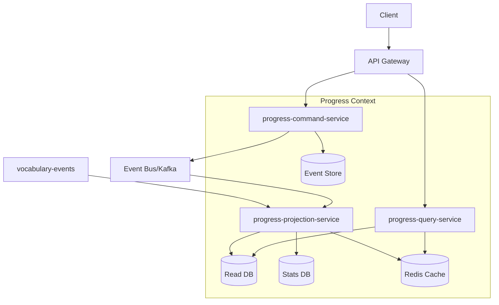

# Progress Context サービス分解設計

## 概要

Progress Context は、学習進捗の記録と SM-2 アルゴリズムによる復習スケジュール管理を担当します。Event Sourcing と CQRS を適用し、3つのマイクロサービスに分解されます。学習履歴の完全な追跡と、様々な観点からの進捗分析を可能にします。

## サービス構成

```
progress-context/
├── progress-command-service     # 学習記録の書き込み、SM-2計算
├── progress-query-service       # 進捗表示、統計情報の提供
└── progress-projection-service  # イベント投影、集計処理
```

## サービス間の関係



## データフロー

### 1. 学習記録フロー

```
1. Client → API Gateway → Command Service
2. Command Service:
   - 学習セッション管理
   - 想起結果の記録
   - SM-2 アルゴリズム実行
   - 次回復習日の計算
3. Event Store に保存
4. Kafka に発行 → 他 Context へ通知
```

### 2. 進捗確認フロー

```
1. Client → API Gateway → Query Service
2. Query Service:
   - ユーザー進捗の取得
   - 学習統計の提供
   - 復習予定の確認
3. Redis キャッシュ活用で高速応答
```

### 3. 統計集計フロー

```
1. Projection Service がイベント受信
2. リアルタイム集計:
   - 日次/週次/月次統計
   - 連続学習日数
   - 難易度分析
3. Read Model と Stats DB を更新
```

## サービス詳細

### progress-command-service

**責務**:

- LearningSession 集約の管理
- Progress 集約の管理
- SM-2 アルゴリズムの実行
- 学習イベントの生成

**主要機能**:

- StartLearningSession: セッション開始
- RecordItemStudy: 項目学習の記録
- RecordRecall: 想起結果の記録
- CalculateNextReview: 次回復習日の計算
- CompleteLearningSession: セッション完了

**技術スタック**:

- Language: Rust
- Framework: Axum (gRPC)
- Database: PostgreSQL (Event Store)
- Algorithm: SM-2 実装

### progress-query-service

**責務**:

- ユーザー進捗情報の提供
- 学習統計の表示
- 復習スケジュールの管理
- ランキング情報の提供

**主要機能**:

- GetUserProgress: 全体進捗
- GetItemProgress: 項目別進捗
- GetDueItems: 復習予定項目
- GetLearningStats: 統計情報
- GetStreakInfo: 連続記録

**技術スタック**:

- Language: Rust
- Framework: Axum (gRPC)
- Database: PostgreSQL (Read Model)
- Cache: Redis

### progress-projection-service

**責務**:

- 学習イベントの処理
- 統計情報の集計
- Read Model の更新
- 外部イベントの処理

**主要機能**:

- UserProgressView の更新
- LearningStatsView の集計
- StreakView の管理
- ItemDifficultyView の計算

**技術スタック**:

- Language: Rust
- Framework: Tokio (非同期処理)
- Message Broker: Kafka Consumer
- Databases: PostgreSQL, Redis

## SM-2 アルゴリズムの実装

### コア計算ロジック

```rust
pub struct SM2Calculator {
    initial_interval: f32,      // 1日
    easy_bonus: f32,           // 1.3
    min_easiness_factor: f32,  // 1.3
}

impl SM2Calculator {
    pub fn calculate_next_review(
        &self,
        quality: RecallQuality,  // 0-5
        repetition: u32,
        previous_interval: f32,
        easiness_factor: f32,
    ) -> SM2Result {
        let q = quality as u8;
        
        // Easiness Factor の更新
        let new_ef = if q >= 3 {
            easiness_factor + (0.1 - (5 - q) as f32 * (0.08 + (5 - q) as f32 * 0.02))
        } else {
            easiness_factor - 0.8
        }.max(self.min_easiness_factor);
        
        // 次回間隔の計算
        let (new_interval, new_repetition) = match q {
            0..=2 => (self.initial_interval, 0), // リセット
            _ => match repetition {
                0 => (1.0, 1),
                1 => (6.0, 2),
                _ => (previous_interval * new_ef, repetition + 1),
            }
        };
        
        SM2Result {
            next_interval_days: new_interval,
            easiness_factor: new_ef,
            repetition_number: new_repetition,
            next_review_date: Utc::now() + Duration::days(new_interval as i64),
        }
    }
}
```

## Read Model 設計

### UserProgressView

```rust
pub struct UserProgressView {
    pub user_id: UserId,
    pub total_items_learned: u32,
    pub items_in_review: u32,
    pub items_due_today: u32,
    pub average_recall_rate: f32,
    pub current_streak: u32,
    pub longest_streak: u32,
    pub total_study_time_minutes: u64,
    pub last_study_date: Option<Date<Utc>>,
    pub next_review_date: Option<DateTime<Utc>>,
}
```

### ItemProgressView

```rust
pub struct ItemProgressView {
    pub progress_id: ProgressId,
    pub user_id: UserId,
    pub item_id: ItemId,
    pub repetition_number: u32,
    pub easiness_factor: f32,
    pub interval_days: f32,
    pub next_review_date: DateTime<Utc>,
    pub last_reviewed: DateTime<Utc>,
    pub total_reviews: u32,
    pub successful_reviews: u32,
    pub average_response_time_ms: u64,
}
```

### LearningStatsView

```rust
pub struct LearningStatsView {
    pub user_id: UserId,
    pub period: StatsPeriod,
    pub items_studied: u32,
    pub items_mastered: u32,
    pub study_sessions: u32,
    pub total_study_time_minutes: u64,
    pub average_session_length_minutes: f32,
    pub recall_rates: HashMap<RecallQuality, u32>,
    pub best_time_of_day: Option<u8>, // 0-23
    pub most_productive_day: Option<Weekday>,
}
```

## パフォーマンス最適化

### キャッシュ戦略

1. **ユーザー進捗**: 5分間キャッシュ
2. **復習予定項目**: 1分間キャッシュ（リアルタイム性重視）
3. **統計情報**: 1時間キャッシュ
4. **ランキング**: 10分間キャッシュ

### データベース最適化

```sql
-- 効率的なインデックス
CREATE INDEX idx_progress_user_next_review 
ON item_progress(user_id, next_review_date) 
WHERE next_review_date IS NOT NULL;

CREATE INDEX idx_progress_user_item 
ON item_progress(user_id, item_id);

-- マテリアライズドビュー
CREATE MATERIALIZED VIEW user_stats_summary AS
SELECT 
    user_id,
    COUNT(DISTINCT item_id) as total_items,
    AVG(easiness_factor) as avg_easiness,
    SUM(CASE WHEN next_review_date < NOW() THEN 1 ELSE 0 END) as due_items
FROM item_progress
GROUP BY user_id;
```

## スケーリング戦略

### Command Service

- 垂直スケーリング優先
- セッション単位でのシャーディング検討

### Query Service

- 水平スケーリング（レプリカ増加）
- 読み取り専用レプリカの活用

### Projection Service

- Kafka パーティション数に応じてスケール
- 集計処理の並列化

## 監視ポイント

### 主要メトリクス

| サービス | メトリクス | 閾値 |
|---------|----------|-----|
| Command | SM-2 計算時間 | < 10ms |
| Command | イベント生成レート | > 100/秒 |
| Query | 進捗取得時間 | < 50ms (p95) |
| Query | キャッシュヒット率 | > 90% |
| Projection | イベント処理遅延 | < 1秒 |
| Projection | 集計処理時間 | < 100ms |

### アラート設定

```yaml
alerts:
  - name: HighSM2CalculationTime
    condition: sm2_calculation_time_p95 > 20ms
    severity: warning
    
  - name: LowCacheHitRate
    condition: cache_hit_rate < 0.8
    severity: warning
    
  - name: ProjectionLag
    condition: projection_lag_seconds > 10
    severity: critical
```

## 更新履歴

- 2025-08-03: 初版作成
