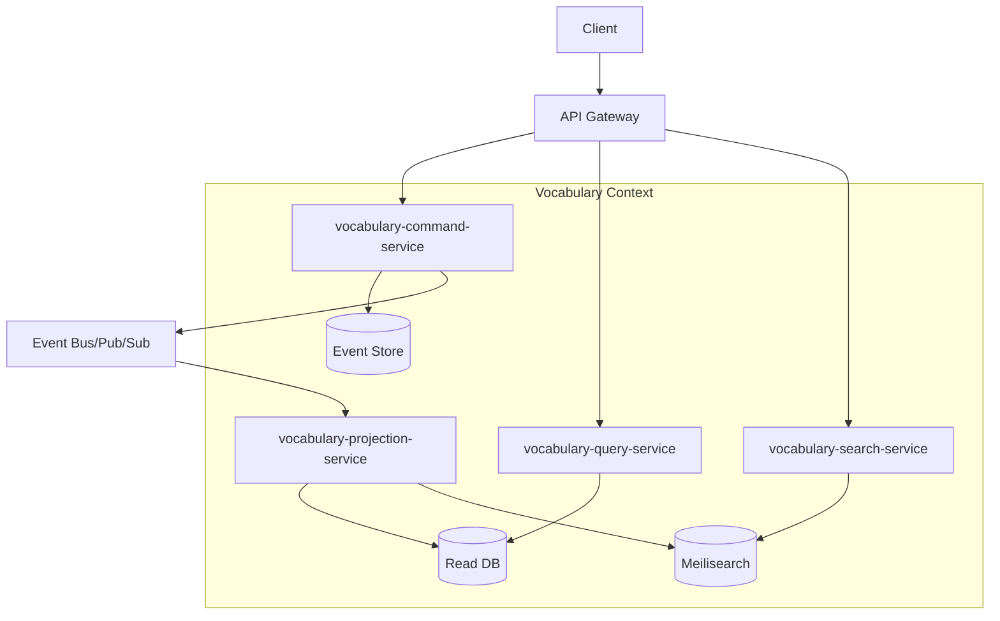

# Vocabulary Context サービス分解設計

## 概要

Vocabulary Context は、Event Sourcing と CQRS を完全に適用し、4つのマイクロサービスに分解されます。これにより、読み書きの独立したスケーリング、最適化されたストレージ、明確な責務分離を実現します。

## サービス構成

```
vocabulary-context/
├── vocabulary-command-service    # Write Model、コマンド処理
├── vocabulary-query-service      # 基本的な Read Model
├── vocabulary-search-service     # 検索特化型サービス
└── vocabulary-projection-service # イベント投影サービス
```

## サービス間の関係



## データフロー

### 1. コマンド処理フロー（Write）

```
1. Client → API Gateway → Command Service
2. Command Service:
   - ビジネスロジック実行
   - ドメインイベント生成
   - Event Store に永続化
   - Pub/Sub に発行
3. Event Bus → 他の Context に通知
```

### 2. クエリ処理フロー（Read）

```
1. Client → API Gateway → Query/Search Service
2. Query Service → Read DB から取得
3. Search Service → Meilisearch から検索
4. レスポンスを返却
```

### 3. プロジェクションフロー（非同期）

```
1. Pub/Sub からイベント受信
2. Projection Service:
   - イベントを Read Model に変換
   - Read DB を更新
   - Search Index を更新
3. 処理完了を記録
```

## サービス詳細

### vocabulary-command-service

**責務**:

- VocabularyEntry/VocabularyItem 集約の管理
- コマンドの検証と実行
- ドメインイベントの生成
- Event Store への永続化

**技術スタック**:

- Language: Rust
- Framework: Axum (gRPC)
- Database: PostgreSQL (Event Store)
- Message Broker: Google Pub/Sub Publisher

### vocabulary-query-service

**責務**:

- 基本的な読み取り操作
- 項目詳細の取得
- エントリー一覧の取得
- シンプルなフィルタリング

**技術スタック**:

- Language: Rust
- Framework: Axum (gRPC)
- Database: PostgreSQL (Read Model)
- Cache: Redis

### vocabulary-search-service

**責務**:

- 全文検索
- 複雑なフィルタリング
- ファセット検索
- 検索候補の提供

**技術スタック**:

- Language: Rust
- Framework: Axum (gRPC)
- Search Engine: Meilisearch
- Cache: Redis

### vocabulary-projection-service

**責務**:

- イベントの消費と処理
- Read Model の更新
- Search Index の更新
- イベント順序の保証

**技術スタック**:

- Language: Rust
- Framework: Tokio (非同期処理)
- Message Broker: Google Pub/Sub Subscriber
- Databases: PostgreSQL, Meilisearch

## スケーリング戦略

### Command Service

- 垂直スケーリング優先
- Event Store への書き込みがボトルネック
- 必要に応じてシャーディング

### Query Service

- 水平スケーリング可能
- Read Replica の活用
- キャッシュによる負荷軽減

### Search Service

- Meilisearch インスタンスでスケール
- 検索負荷に応じてノード追加
- インデックスの最適化

### Projection Service

- Pub/Sub の並列処理でスケール
- 複数のサブスクライバーで並列処理
- バックプレッシャー制御

## 障害対策

### サービス障害時の動作

1. **Command Service 障害**:
   - 書き込み不可
   - 読み取りは継続可能
   - Circuit Breaker で高速フェイル

2. **Query/Search Service 障害**:
   - 該当機能のみ影響
   - 他のサービスで代替可能な場合は縮退運転

3. **Projection Service 障害**:
   - Read Model の更新遅延
   - Pub/Sub のメッセージ確認応答により再開可能
   - 最終的に整合性を保証

## 監視ポイント

### メトリクス

| サービス | 主要メトリクス |
|---------|--------------|
| Command | コマンド処理レート、Event Store レイテンシ |
| Query | クエリ応答時間、キャッシュヒット率 |
| Search | 検索レイテンシ、インデックスサイズ |
| Projection | イベント処理遅延、バックログサイズ |

### アラート設定

- Command Service: 5秒以上の処理遅延
- Query Service: 100ms 以上の応答時間（p95）
- Search Service: 500ms 以上の検索時間（p95）
- Projection Service: 1000件以上のバックログ

## セキュリティ

### サービス間認証

- mTLS による相互認証
- Service Mesh (Istio) の活用

### アクセス制御

- Command Service: 書き込み権限の厳格な管理
- Query/Search: 読み取り専用アクセス
- Projection: 内部サービスのみアクセス可

## 開発ガイドライン

### ローカル開発環境

```yaml
# docker-compose.yml
services:
  vocabulary-command:
    build: ./vocabulary-command-service
    ports:
      - "50051:50051"
    
  vocabulary-query:
    build: ./vocabulary-query-service
    ports:
      - "50052:50052"
    
  vocabulary-search:
    build: ./vocabulary-search-service
    ports:
      - "50053:50053"
    
  vocabulary-projection:
    build: ./vocabulary-projection-service
```

### テスト戦略

1. **単体テスト**: 各サービス個別
2. **統合テスト**: Event Store/Pub/Sub との連携
3. **E2E テスト**: 全サービス連携
4. **カオステスト**: 障害シナリオ

## 更新履歴

- 2025-08-03: 初版作成
