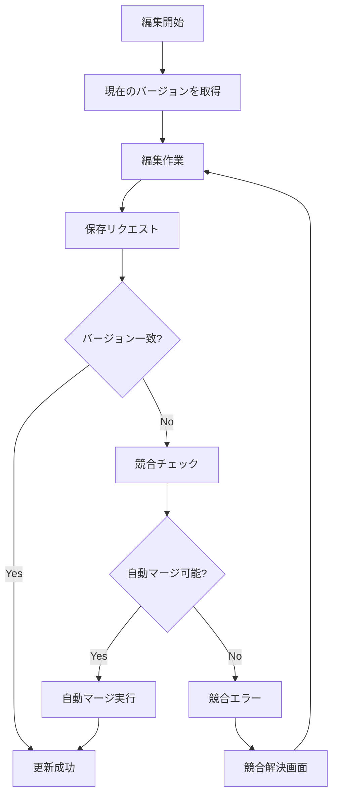

# Vocabulary Context - EventStorming Design Level

## 概要

Vocabulary Context は、Effect プロジェクトにおける語彙コンテンツ管理の中核です。全ユーザーが共有するグローバル辞書を管理し、AI と連携して豊富な語彙情報を提供します。

### 主要な設計方針

1. **Wikipedia 方式**: 1つの綴り（spelling）に対して複数の意味（disambiguation）を持つ項目を管理
2. **楽観的ロック + 自動マージ**: 並行編集に対して可能な限り自動マージを試みる
3. **イベントソーシング**: すべての変更を記録し、完全な履歴とバージョン管理を実現
4. **AI との非同期連携**: 項目情報の生成を AI に委譲し、非同期で処理

### 主要な責務

- グローバル辞書の管理（全ユーザー共有）
- 項目（単語、フレーズ、熟語）の CRUD 操作
- AI を活用した項目情報の生成と管理
- 並行編集の処理と競合解決
- 完全な変更履歴の保持

## 集約の設計

### 1. VocabularyEntry（見出し語）- 軽量な集約

```rust
pub struct VocabularyEntry {
    entry_id: EntryId,
    spelling: String,  // "apple"
    items: Vec<ItemSummary>,
    created_at: DateTime<Utc>,
}

pub struct ItemSummary {
    item_id: ItemId,
    disambiguation: String,  // "(fruit)", "(company)"
    is_primary: bool,  // 最も一般的な意味
}
```

### 2. VocabularyItem（語彙項目）- メイン集約ルート

```rust
pub struct VocabularyItem {
    item_id: ItemId,
    entry_id: EntryId,
    spelling: String,
    disambiguation: String,
    
    // 詳細情報
    pronunciation: Option<String>,
    phonetic_respelling: Option<String>,
    definitions: Vec<Definition>,
    parts_of_speech: Vec<PartOfSpeech>,
    examples: Vec<Example>,
    synonyms: Vec<String>,
    antonyms: Vec<String>,
    collocations: Vec<Collocation>,
    register: Option<Register>,  // formal, informal, etc
    cefr_level: Option<CefrLevel>,
    tags: Vec<Tag>,
    
    // メタ情報
    created_by: CreatedBy,
    created_at: DateTime<Utc>,
    last_modified_at: DateTime<Utc>,
    last_modified_by: ModifiedBy,
    version: u32,  // 楽観的ロック
    status: ItemStatus,
}

pub enum ItemStatus {
    Draft,           // 作成中
    PendingAI,       // AI生成待ち
    Published,       // 公開済み
}

pub enum CreatedBy {
    User(UserId),
    System,
    Import { source: String },
}

pub struct Definition {
    meaning: String,
    examples: Vec<String>,
    domain: Option<String>,  // medical, technical, etc
}
```

### 3. FieldChange（フィールド変更）- 値オブジェクト

```rust
pub struct FieldChange {
    field_path: String,  // "definitions[0].meaning"
    old_value: Option<serde_json::Value>,
    new_value: serde_json::Value,
}
```

## コマンドとイベント

### コマンド（青い付箋 🟦）

```rust
pub enum VocabularyCommand {
    CreateItem {
        spelling: String,
        disambiguation: String,
        creation_method: CreationMethod,
        creator: CreatedBy,
    },
    
    UpdateItem {
        item_id: ItemId,
        base_version: u32,  // 楽観的ロック用
        changes: Vec<FieldChange>,
        editor: UserId,
    },
    
    RequestAIGeneration {
        item_id: ItemId,
        regenerate: bool,  // 再生成かどうか
    },
    
    ApplyAIGeneratedContent {
        item_id: ItemId,
        generated_content: GeneratedContent,
        ai_model: String,
    },
    
    PublishItem {
        item_id: ItemId,
    },
}

pub enum CreationMethod {
    AiGeneration,
    ManualInput { initial_content: InitialContent },
    Import { source: String },
}
```

### ドメインイベント（オレンジの付箋 🟠）

```rust
pub enum VocabularyDomainEvent {
    // エントリー関連
    EntryCreated {
        event_id: EventId,
        occurred_at: DateTime<Utc>,
        entry_id: EntryId,
        spelling: String,
    },
    
    // 項目作成
    ItemCreated {
        event_id: EventId,
        occurred_at: DateTime<Utc>,
        item_id: ItemId,
        entry_id: EntryId,
        spelling: String,
        disambiguation: String,
        created_by: CreatedBy,
    },
    
    // フィールド更新（細かく記録）
    FieldUpdated {
        event_id: EventId,
        occurred_at: DateTime<Utc>,
        item_id: ItemId,
        field_path: String,
        old_value: Option<serde_json::Value>,
        new_value: serde_json::Value,
        updated_by: UserId,
        version: u32,  // 更新後のバージョン
    },
    
    // AI生成関連
    AIGenerationRequested {
        event_id: EventId,
        occurred_at: DateTime<Utc>,
        item_id: ItemId,
        is_regeneration: bool,
    },
    
    AIGenerationCompleted {
        event_id: EventId,
        occurred_at: DateTime<Utc>,
        item_id: ItemId,
        generated_content: GeneratedContent,
        ai_model: String,
    },
    
    AIGenerationFailed {
        event_id: EventId,
        occurred_at: DateTime<Utc>,
        item_id: ItemId,
        error: String,
        retry_count: u32,
    },
    
    // ステータス変更
    ItemPublished {
        event_id: EventId,
        occurred_at: DateTime<Utc>,
        item_id: ItemId,
    },
    
    // 競合
    UpdateConflicted {
        event_id: EventId,
        occurred_at: DateTime<Utc>,
        item_id: ItemId,
        attempted_by: UserId,
        expected_version: u32,
        actual_version: u32,
        conflicting_fields: Vec<String>,
    },
}
```

## 並行編集の処理

### 楽観的ロックの実装

```rust
impl VocabularyItem {
    pub fn update_fields(
        &mut self,
        base_version: u32,
        changes: Vec<FieldChange>,
        updated_by: UserId,
    ) -> Result<Vec<VocabularyDomainEvent>> {
        if base_version != self.version {
            // バージョン不一致 - 競合の可能性
            let conflicts = self.find_conflicts(base_version, &changes)?;
            
            if conflicts.is_empty() {
                // 自動マージ可能
                self.apply_changes(&changes);
                self.version += 1;
                self.last_modified_at = Utc::now();
                self.last_modified_by = ModifiedBy::User(updated_by);
                
                let events = self.create_update_events(changes, updated_by);
                Ok(events)
            } else {
                // 競合 - 手動解決が必要
                Err(UpdateConflict {
                    current_version: self.version,
                    conflicting_fields: conflicts,
                })
            }
        } else {
            // 通常の更新
            self.apply_changes(&changes);
            self.version += 1;
            self.last_modified_at = Utc::now();
            self.last_modified_by = ModifiedBy::User(updated_by);
            
            let events = self.create_update_events(changes, updated_by);
            Ok(events)
        }
    }
    
    fn find_conflicts(
        &self, 
        base_version: u32, 
        changes: &[FieldChange]
    ) -> Result<Vec<String>> {
        // base_version 以降の変更を取得
        let recent_changes = self.get_changes_since(base_version)?;
        
        // 同じフィールドへの変更をチェック
        let changed_fields: HashSet<&str> = changes.iter()
            .map(|c| c.field_path.as_str())
            .collect();
            
        let conflicts = recent_changes.iter()
            .filter(|rc| changed_fields.contains(rc.field_path.as_str()))
            .map(|rc| rc.field_path.clone())
            .collect();
            
        Ok(conflicts)
    }
}
```

### フロー図



## バージョン管理とイベントソーシング

### 完全な履歴の記録

```rust
// イベントストアからの状態復元
pub struct ItemSnapshot {
    item_id: ItemId,
    version: u32,
    content: VocabularyItem,
    timestamp: DateTime<Utc>,
}

impl VocabularyItemProjection {
    // 特定バージョンの状態を取得
    pub fn get_at_version(&self, item_id: ItemId, version: u32) -> Result<ItemSnapshot> {
        let events = event_store.get_events_up_to(item_id, version)?;
        let snapshot = self.rebuild_from_events(events)?;
        Ok(snapshot)
    }
    
    // 変更履歴の取得
    pub fn get_change_history(&self, item_id: ItemId) -> Result<Vec<ChangeHistory>> {
        let events = event_store.get_all_events(item_id)?;
        let history = events.into_iter()
            .filter_map(|e| self.to_history_entry(e))
            .collect();
        Ok(history)
    }
    
    // イベントから状態を再構築
    fn rebuild_from_events(&self, events: Vec<VocabularyDomainEvent>) -> Result<VocabularyItem> {
        let mut item = VocabularyItem::default();
        
        for event in events {
            match event {
                VocabularyDomainEvent::ItemCreated { .. } => {
                    item = VocabularyItem::from_creation_event(event);
                }
                VocabularyDomainEvent::FieldUpdated { field_path, new_value, .. } => {
                    item.apply_field_update(&field_path, new_value)?;
                    item.version += 1;
                }
                // ... 他のイベント処理
            }
        }
        
        Ok(item)
    }
}

pub struct ChangeHistory {
    version: u32,
    changed_at: DateTime<Utc>,
    changed_by: String,
    changes: Vec<FieldChangeSummary>,
}
```

## AI Integration との連携

### 非同期項目情報生成フロー

```
[項目作成] → (VocabularyItem) → [項目が作成された]
                                     ↓
                              [AI生成が要求された]
                                     ↓
                      (AI Integration Context で処理)
                                     ↓
                              [AI生成が完了した]
                                     ↓
[AI結果を適用] → (VocabularyItem) → [項目情報が更新された]
                                     ↓
                              [項目が公開された]
```

### 実装例

```rust
// AI生成要求の処理
impl VocabularyItem {
    pub fn request_ai_generation(&self) -> Result<VocabularyDomainEvent> {
        match self.status {
            ItemStatus::Draft | ItemStatus::Published => {
                Ok(VocabularyDomainEvent::AIGenerationRequested {
                    event_id: EventId::new(),
                    occurred_at: Utc::now(),
                    item_id: self.item_id,
                    is_regeneration: self.status == ItemStatus::Published,
                })
            }
            ItemStatus::PendingAI => {
                Err(DomainError::AIGenerationAlreadyInProgress)
            }
        }
    }
    
    pub fn apply_ai_content(
        &mut self, 
        content: GeneratedContent,
        ai_model: String
    ) -> Result<Vec<VocabularyDomainEvent>> {
        // AI生成内容を適用
        self.apply_generated_content(content)?;
        self.status = ItemStatus::Published;
        self.version += 1;
        
        Ok(vec![
            VocabularyDomainEvent::AIGenerationCompleted { /* ... */ },
            VocabularyDomainEvent::ItemPublished { /* ... */ },
        ])
    }
}
```

## ビジネスポリシー（紫の付箋 🟪）

### 項目作成ポリシー

```rust
// 重複チェックポリシー
when CreateItemCommand {
    // 同じ spelling + disambiguation は作成不可
    if exists_item(spelling, disambiguation) {
        reject with DuplicateItemError
    }
    
    // エントリーがなければ自動作成
    if !exists_entry(spelling) {
        emit EntryCreatedEvent
    }
    
    emit ItemCreatedEvent
}
```

### AI生成完了ポリシー

```rust
when AIGenerationCompletedEvent {
    if item.status == PendingAI {
        apply_ai_content()
        update_status(Published)
        emit ItemPublishedEvent
    }
}
```

### 自動マージポリシー

```rust
when UpdateConflict {
    // 異なるフィールドへの変更は自動マージ
    if no_field_overlap(user_changes, concurrent_changes) {
        auto_merge_changes()
        emit FieldUpdatedEvent
    } else {
        emit UpdateConflictedEvent
    }
}
```

## リードモデル（緑の付箋 🟩）

### ItemSearchView（検索用）

```rust
pub struct ItemSearchView {
    item_id: ItemId,
    spelling: String,
    disambiguation: String,
    definitions_preview: String,  // 最初の定義の要約
    cefr_level: Option<CefrLevel>,
    tags: Vec<String>,
    
    // 検索用メタデータ
    popularity_score: f32,
    last_accessed: DateTime<Utc>,
    usage_count: u32,
}
```

### ItemDetailView（詳細表示用）

```rust
pub struct ItemDetailView {
    // 基本情報
    item_id: ItemId,
    spelling: String,
    disambiguation: String,
    
    // 表示用に整形済み
    pronunciation_html: String,
    phonetic_ipa: String,
    definitions_formatted: Vec<DefinitionView>,
    examples_highlighted: Vec<ExampleView>,
    
    // 関連情報
    synonyms_linked: Vec<LinkedWord>,
    antonyms_linked: Vec<LinkedWord>,
    collocations_grouped: HashMap<String, Vec<Collocation>>,
    
    // メタ情報
    version: u32,
    last_edited_by: String,
    last_edited_at: String,  // "2 hours ago"
    edit_count: u32,
    ai_generated: bool,
}

pub struct DefinitionView {
    number: u32,
    part_of_speech: String,
    meaning_html: String,
    examples: Vec<String>,
    domain: Option<String>,
}
```

### ConflictResolutionView（競合解決用）

```rust
pub struct ConflictResolutionView {
    item_id: ItemId,
    spelling: String,
    
    // バージョン情報
    your_version: u32,
    current_version: u32,
    
    // 競合詳細
    conflicts: Vec<FieldConflict>,
    
    // 解決オプション
    auto_mergeable_changes: Vec<FieldChange>,
    conflicting_changes: Vec<ConflictingChange>,
}

pub struct ConflictingChange {
    field_path: String,
    field_name: String,  // 人間が読める名前
    your_value: serde_json::Value,
    their_value: serde_json::Value,
    base_value: Option<serde_json::Value>,
}
```

### ChangeHistoryView（変更履歴表示用）

```rust
pub struct ChangeHistoryView {
    item_id: ItemId,
    total_versions: u32,
    changes: Vec<ChangeEntry>,
}

pub struct ChangeEntry {
    version: u32,
    timestamp: String,  // "2024-01-20 14:30"
    author: String,
    author_type: String,  // "User", "AI", "System"
    summary: String,  // "Updated 3 definitions and added 2 examples"
    details: Vec<ChangeDetail>,
}
```

## 他コンテキストとの連携

### Learning Context との連携

- テスト用項目情報の提供（同期API）
- 学習頻度の統計情報受信（イベント駆動）

### AI Integration Context との連携

- 項目情報生成要求（メッセージキュー）
- 生成結果の受信（コールバック）

### User Context との連携

- 項目作成者の情報取得
- 編集権限の確認

## CQRS 適用方針

### 適用状況: ✅ フル CQRS

Vocabulary Context では、Write Model と Read Model を明確に分離した CQRS を採用しています。

### 理由

1. **検索要件の複雑さ**
   - 全文検索、カテゴリ検索、タグ検索など多様な検索パターン
   - 検索用に最適化されたインデックスが必要
   - Write Model の正規化構造とは異なる非正規化が有効

2. **表示形式の多様性**
   - 検索結果（ItemSearchView）：軽量な情報のみ
   - 詳細表示（ItemDetailView）：リッチなフォーマット済みデータ
   - 競合解決（ConflictResolutionView）：差分比較用の特殊形式
   - 変更履歴（ChangeHistoryView）：時系列データ

3. **スケーラビリティ**
   - 読み取り（辞書検索）が圧倒的に多い
   - グローバル辞書として多数のユーザーが参照
   - Read Model は積極的にキャッシュ可能

### Write Model（Command 側）

- **VocabularyEntry（集約）**: Wikipedia スタイルの語彙エントリ
- **VocabularyItem（エンティティ）**: 個々の意味・用法
- **責務**: 語彙情報の管理、バージョン管理、競合解決、イベント発行

### Read Model（Query 側）

- **ItemSearchView**: 検索結果表示用（軽量）
- **ItemDetailView**: 詳細表示用（フォーマット済み）
- **ConflictResolutionView**: 競合解決UI用
- **ChangeHistoryView**: 変更履歴表示用
- **責務**: 各用途に最適化されたデータ提供

### データ同期

- Write Model の変更時に VocabularyUpdated イベントを発行
- プロジェクションハンドラーが各 Read Model を更新
- 検索インデックスの更新は非同期バッチ処理も併用

### アーキテクチャ学習の観点

Vocabulary Context の CQRS 実装を通じて以下を学習：

- 検索に最適化された Read Model の設計
- イベントソーシングによる完全な変更履歴の実装
- 複数の Read Model を用途別に設計する手法
- 大規模データに対するパフォーマンス最適化

## 実装の考慮事項

### パフォーマンス最適化

- 大規模な辞書（数万〜数十万項目）への対応
- 頻繁にアクセスされる項目のキャッシュ
- リードモデルの事前計算とインデックス

### データ整合性

- Wikipedia 方式での親子関係の整合性
- 削除時の参照整合性
- イベントの順序保証

### 拡張性

- 新しい言語への対応
- カスタムフィールドの追加
- 外部辞書との連携

## 更新履歴

- 2025-07-27: 初版作成（ユーザーとの対話に基づく詳細設計）
- 2025-07-28: CQRS 適用方針セクションを追加（フル CQRS 採用、複数の Read Model 設計を明記）
