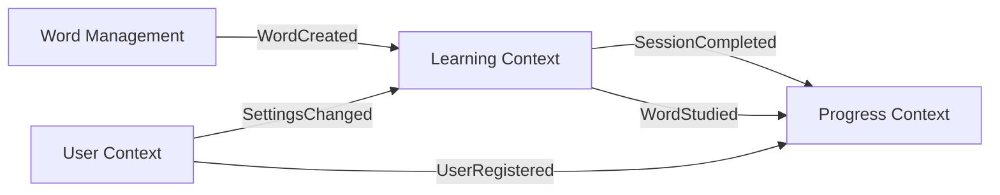

# EventStorming - Design Level

## 概要

このドキュメントでは、各境界づけられたコンテキストの詳細な設計レベルのイベントストーミングを記録します。

## Learning Context

### コマンド → イベントフロー

```
[学習セッションを開始する] → (Learning Session) → [セッションが開始された]
                                    ↓
                            [単語が選択された]
                                    ↓
[問題を表示する] → (Question) → [問題が生成された]
                                    ↓
[回答を送信する] → (Answer Evaluation) → [回答が評価された]
                                    ↓
                            [進捗が更新された]
                                    ↓
[セッションを完了する] → (Session) → [セッションが完了した]
```

### アグリゲート詳細

#### Learning Session Aggregate

```rust
pub struct LearningSession {
    id: SessionId,
    user_id: UserId,
    started_at: DateTime<Utc>,
    word_ids: Vec<WordId>,
    questions: Vec<Question>,
    current_question_index: usize,
    state: SessionState,
}

pub enum SessionState {
    InProgress,
    Completed,
    Abandoned,
}

// コマンド
pub enum SessionCommand {
    StartSession { user_id: UserId, word_ids: Vec<WordId> },
    SubmitAnswer { question_id: QuestionId, answer: String },
    CompleteSession,
    AbandonSession,
}

// イベント
pub enum SessionEvent {
    SessionStarted { session_id: SessionId, user_id: UserId, word_ids: Vec<WordId> },
    QuestionGenerated { question_id: QuestionId, word_id: WordId, question_type: QuestionType },
    AnswerSubmitted { question_id: QuestionId, answer: String, is_correct: bool },
    SessionCompleted { session_id: SessionId, results: SessionResults },
}
```

#### User Progress Aggregate

```rust
pub struct UserProgress {
    user_id: UserId,
    word_id: WordId,
    sm2_params: SM2Parameters,
    review_history: Vec<ReviewRecord>,
    next_review_date: Date,
}

// ポリシー: SM-2 アルゴリズム
pub fn calculate_next_review(
    quality: u8,
    current_params: &SM2Parameters,
) -> (SM2Parameters, Date) {
    // アルゴリズム実装
}
```

### リードモデル

```rust
// 今日の学習単語を取得するためのリードモデル
pub struct DailyWordList {
    user_id: UserId,
    date: Date,
    new_words: Vec<WordId>,      // 新規学習
    review_words: Vec<WordId>,    // 復習対象
    overdue_words: Vec<WordId>,   // 期限切れ
}

// セッション履歴のリードモデル
pub struct SessionHistory {
    user_id: UserId,
    sessions: Vec<SessionSummary>,
    total_words_learned: u32,
    average_accuracy: f32,
}
```

## Word Management Context

### コマンド → イベントフロー

```
[単語を登録する] → (Word) → [単語が作成された]
                        ↓
                [初期情報が設定された]
                        ↓
[意味を追加する] → (Word) → [意味が追加された]
                        ↓
[例文を追加する] → (Word) → [例文が追加された]
                        ↓
[単語を編集する] → (Word) → [単語が更新された]
                        ↓
                [編集履歴が記録された]
```

### アグリゲート詳細

#### Word Aggregate

```rust
pub struct Word {
    id: WordId,
    text: String,
    meanings: Vec<Meaning>,
    examples: Vec<Example>,
    metadata: WordMetadata,
    version: u32,  // 楽観的ロック
}

pub struct WordMetadata {
    phonetic_ipa: String,
    difficulty: u8,
    categories: Vec<Category>,
    tags: Vec<Tag>,
    created_by: UserId,
    created_at: DateTime<Utc>,
}

// コマンド
pub enum WordCommand {
    CreateWord {
        text: String,
        initial_meaning: String,
        category: Category,
        created_by: UserId,
    },
    AddMeaning {
        word_id: WordId,
        meaning: String,
        part_of_speech: PartOfSpeech,
        added_by: UserId,
    },
    UpdateWord {
        word_id: WordId,
        changes: WordChanges,
        version: u32,
        updated_by: UserId,
    },
}

// イベント
pub enum WordEvent {
    WordCreated { word_id: WordId, text: String, created_by: UserId },
    MeaningAdded { word_id: WordId, meaning_id: MeaningId, meaning: Meaning },
    WordUpdated { word_id: WordId, changes: WordChanges, version: u32 },
}
```

#### Word Relations Aggregate

```rust
pub struct WordRelation {
    id: RelationId,
    word_id: WordId,
    related_word_id: WordId,
    relation_type: RelationType,
    created_by: UserId,
}
```

### ポリシー

1. **重複チェックポリシー**

   - 同じテキストの単語は登録できない
   - スペルバリエーションは関連として登録

2. **編集権限ポリシー**
   - ログインユーザーは誰でも編集可能
   - 同時編集は楽観的ロックで制御

## User Context

### コマンド → イベントフロー

```
[ユーザーを登録する] → (User) → [ユーザーが登録された]
                            ↓
                    [初期プロフィールが作成された]
                            ↓
[プロフィールを更新する] → (User) → [プロフィールが更新された]
                            ↓
[設定を変更する] → (UserSettings) → [設定が変更された]
```

### アグリゲート詳細

#### User Aggregate

```rust
pub struct User {
    id: UserId,
    email: Email,
    profile: UserProfile,
    settings: UserSettings,
    auth_info: AuthInfo,
}

pub struct UserProfile {
    display_name: String,
    bio: Option<String>,
    avatar_url: Option<Url>,
    learning_goals: Vec<LearningGoal>,
}

pub struct UserSettings {
    daily_goal: u32,
    reminder_time: Option<Time>,
    notification_enabled: bool,
    preferred_categories: Vec<Category>,
}
```

## Progress Context

### イベント駆動フロー

```
[セッションが完了した] → (Statistics Calculator) → [統計が更新された]
                                            ↓
                                    [ストリークが確認された]
                                            ↓
                                    [達成度が計算された]
                                            ↓
[マイルストーンに到達した] → (Achievement) → [バッジが獲得された]
```

### リードモデル

```rust
pub struct UserStatistics {
    user_id: UserId,
    total_words_learned: u32,
    total_sessions: u32,
    current_streak: u32,
    longest_streak: u32,
    category_progress: HashMap<Category, CategoryStats>,
    daily_stats: Vec<DailyStats>,
}

pub struct LeaderBoard {
    period: Period,
    rankings: Vec<UserRanking>,
}
```

## 統合ポイント

### イベントフロー図



## 実装優先順位

### Phase 1 (MVP)

1. Basic Word CRUD
2. Simple Learning Session
3. User Registration/Login
4. Basic Progress Tracking

### Phase 2

1. SM-2 Algorithm
2. Collaborative Editing
3. Detailed Statistics
4. Notifications

### Phase 3

1. Advanced Analytics
2. Social Features
3. AI Recommendations
4. Gamification

## 更新履歴

- 2025-07-25: 初版作成（テンプレート）
