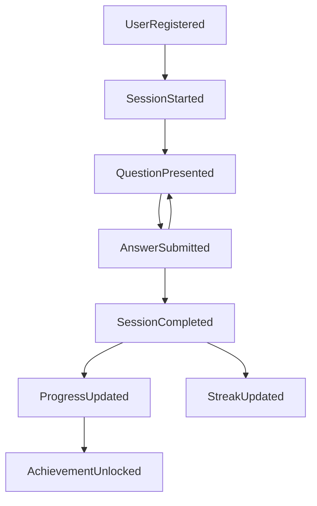

# イベントカタログ

## 概要

このドキュメントでは、Effect システムで使用されるすべてのドメインイベントを一覧化し、各イベントの詳細仕様を定義します。

## イベント命名規則

- 過去形で記述（例: `WordCreated`, `SessionCompleted`）
- アグリゲート名を接頭辞に含める
- 明確で具体的なアクションを表現

## イベント基本構造

```rust
#[derive(Debug, Clone, Serialize, Deserialize)]
pub struct EventEnvelope {
    pub id: EventId,
    pub aggregate_id: String,
    pub aggregate_type: String,
    pub event_type: String,
    pub event_data: DomainEvent,
    pub event_version: u32,
    pub sequence_number: u64,
    pub occurred_at: DateTime<Utc>,
    pub metadata: EventMetadata,
}

#[derive(Debug, Clone, Serialize, Deserialize)]
pub struct EventMetadata {
    pub correlation_id: Option<CorrelationId>,
    pub causation_id: Option<CausationId>,
    pub user_id: Option<UserId>,
    pub trace_id: Option<String>,
}
```

## 1. Word Management Context

### WordCreated

**概要**: 新しい単語が登録された

```rust
#[derive(Debug, Clone, Serialize, Deserialize)]
pub struct WordCreated {
    pub word_id: WordId,
    pub text: String,
    pub initial_meaning: String,
    pub categories: Vec<Category>,
    pub difficulty: u8,
    pub created_by: UserId,
    pub created_at: DateTime<Utc>,
}
```

**発生条件**:

- 新規単語登録コマンドが成功した時

**影響**:

- 読み取りモデルに単語情報が追加される
- 学習可能な単語として利用可能になる

### WordMeaningAdded

**概要**: 単語に新しい意味が追加された

```rust
#[derive(Debug, Clone, Serialize, Deserialize)]
pub struct WordMeaningAdded {
    pub word_id: WordId,
    pub meaning_id: MeaningId,
    pub text: String,
    pub part_of_speech: PartOfSpeech,
    pub usage_note: Option<String>,
    pub added_by: UserId,
    pub added_at: DateTime<Utc>,
}
```

**発生条件**:

- 既存の単語に意味を追加するコマンドが成功した時

**影響**:

- 単語の意味リストが更新される
- バージョン番号がインクリメントされる

### WordExampleAdded

**概要**: 単語に例文が追加された

```rust
#[derive(Debug, Clone, Serialize, Deserialize)]
pub struct WordExampleAdded {
    pub word_id: WordId,
    pub example_id: ExampleId,
    pub meaning_id: MeaningId,
    pub sentence: String,
    pub translation: String,
    pub context: Option<Context>,
    pub added_by: UserId,
    pub added_at: DateTime<Utc>,
}
```

**発生条件**:

- 特定の意味に対して例文を追加した時

**影響**:

- 学習時により具体的な使用例が提示される

### WordUpdated

**概要**: 単語の基本情報が更新された

```rust
#[derive(Debug, Clone, Serialize, Deserialize)]
pub struct WordUpdated {
    pub word_id: WordId,
    pub changes: WordChanges,
    pub previous_version: u32,
    pub updated_by: UserId,
    pub updated_at: DateTime<Utc>,
}

#[derive(Debug, Clone, Serialize, Deserialize)]
pub struct WordChanges {
    pub phonetic_ipa: Option<String>,
    pub phonetic_spelling: Option<String>,
    pub difficulty: Option<u8>,
    pub categories: Option<Vec<Category>>,
    pub tags: Option<Vec<Tag>>,
}
```

**発生条件**:

- 単語の編集が成功した時

**影響**:

- 読み取りモデルが更新される
- 学習アルゴリズムの選択基準が変わる可能性

### WordAudioGenerated

**概要**: 単語の音声ファイルが生成された

```rust
#[derive(Debug, Clone, Serialize, Deserialize)]
pub struct WordAudioGenerated {
    pub word_id: WordId,
    pub audio_url: String,
    pub voice_type: VoiceType,
    pub generated_at: DateTime<Utc>,
}
```

**発生条件**:

- TTS サービスによる音声生成が完了した時

**影響**:

- リスニング問題で使用可能になる

### WordFavorited

**概要**: ユーザーが単語をお気に入りに追加した

```rust
#[derive(Debug, Clone, Serialize, Deserialize)]
pub struct WordFavorited {
    pub word_id: WordId,
    pub user_id: UserId,
    pub favorited_at: DateTime<Utc>,
}
```

**発生条件**:

- ユーザーがお気に入りボタンをクリックした時

**影響**:

- ユーザーの個人設定が更新される
- 学習優先度が上がる

### WordUnfavorited

**概要**: ユーザーが単語をお気に入りから削除した

```rust
#[derive(Debug, Clone, Serialize, Deserialize)]
pub struct WordUnfavorited {
    pub word_id: WordId,
    pub user_id: UserId,
    pub unfavorited_at: DateTime<Utc>,
}
```

## 2. Learning Context

### SessionStarted

**概要**: 学習セッションが開始された

```rust
#[derive(Debug, Clone, Serialize, Deserialize)]
pub struct SessionStarted {
    pub session_id: SessionId,
    pub user_id: UserId,
    pub mode: LearningMode,
    pub word_ids: Vec<WordId>,
    pub config: SessionConfig,
    pub started_at: DateTime<Utc>,
}

#[derive(Debug, Clone, Serialize, Deserialize)]
pub struct SessionConfig {
    pub word_count: u32,
    pub time_limit: Option<Duration>,
    pub difficulty_range: (u8, u8),
}
```

**発生条件**:

- ユーザーが学習を開始した時

**影響**:

- アクティブセッション数が増加
- 単語選択アルゴリズムが実行される

### QuestionPresented

**概要**: 問題が表示された

```rust
#[derive(Debug, Clone, Serialize, Deserialize)]
pub struct QuestionPresented {
    pub session_id: SessionId,
    pub question_id: QuestionId,
    pub word_id: WordId,
    pub question_type: QuestionType,
    pub options: Option<Vec<String>>,
    pub presented_at: DateTime<Utc>,
}
```

**発生条件**:

- 次の問題に進んだ時

**影響**:

- 回答待ち状態になる

### AnswerSubmitted

**概要**: 回答が送信された

```rust
#[derive(Debug, Clone, Serialize, Deserialize)]
pub struct AnswerSubmitted {
    pub session_id: SessionId,
    pub question_id: QuestionId,
    pub word_id: WordId,
    pub answer: String,
    pub is_correct: bool,
    pub response_time_ms: u32,
    pub submitted_at: DateTime<Utc>,
}
```

**発生条件**:

- ユーザーが回答を送信した時

**影響**:

- 正答率が計算される
- 次の問題または結果画面へ遷移

### SessionCompleted

**概要**: 学習セッションが完了した

```rust
#[derive(Debug, Clone, Serialize, Deserialize)]
pub struct SessionCompleted {
    pub session_id: SessionId,
    pub user_id: UserId,
    pub results: SessionResults,
    pub completed_at: DateTime<Utc>,
}

#[derive(Debug, Clone, Serialize, Deserialize)]
pub struct SessionResults {
    pub total_questions: u32,
    pub correct_count: u32,
    pub accuracy_percentage: f32,
    pub duration_seconds: u32,
    pub word_results: Vec<WordResult>,
}

#[derive(Debug, Clone, Serialize, Deserialize)]
pub struct WordResult {
    pub word_id: WordId,
    pub was_correct: bool,
    pub quality_rating: u8,  // 0-5 for SM-2
    pub response_time_ms: u32,
}
```

**発生条件**:

- すべての問題に回答した時
- 制限時間に達した時
- ユーザーが終了した時

**影響**:

- 学習履歴が記録される
- SM-2 パラメータが更新される
- 次回復習日が計算される

### SessionAbandoned

**概要**: 学習セッションが中断された

```rust
#[derive(Debug, Clone, Serialize, Deserialize)]
pub struct SessionAbandoned {
    pub session_id: SessionId,
    pub user_id: UserId,
    pub reason: AbandonReason,
    pub questions_answered: u32,
    pub abandoned_at: DateTime<Utc>,
}

#[derive(Debug, Clone, Serialize, Deserialize)]
pub enum AbandonReason {
    UserAction,
    Timeout,
    SystemError,
}
```

**発生条件**:

- ユーザーが明示的に中断した時
- タイムアウトした時
- システムエラーが発生した時

**影響**:

- 部分的な結果のみ記録される
- 完了率に影響する

### ProgressUpdated

**概要**: 学習進捗が更新された

```rust
#[derive(Debug, Clone, Serialize, Deserialize)]
pub struct ProgressUpdated {
    pub user_id: UserId,
    pub word_id: WordId,
    pub previous_params: SM2Parameters,
    pub new_params: SM2Parameters,
    pub next_review_date: Date,
    pub mastery_level: f32,
    pub updated_at: DateTime<Utc>,
}
```

**発生条件**:

- SessionCompleted イベントの処理時

**影響**:

- 復習スケジュールが更新される
- 習熟度が変化する

## 3. User Context

### UserRegistered

**概要**: 新規ユーザーが登録された

```rust
#[derive(Debug, Clone, Serialize, Deserialize)]
pub struct UserRegistered {
    pub user_id: UserId,
    pub email: String,
    pub display_name: String,
    pub auth_method: AuthMethod,
    pub registered_at: DateTime<Utc>,
}

#[derive(Debug, Clone, Serialize, Deserialize)]
pub enum AuthMethod {
    EmailPassword,
    OAuth { provider: String },
}
```

**発生条件**:

- ユーザー登録が成功した時

**影響**:

- ユーザーアカウントが作成される
- デフォルト設定が初期化される

### UserProfileUpdated

**概要**: ユーザープロフィールが更新された

```rust
#[derive(Debug, Clone, Serialize, Deserialize)]
pub struct UserProfileUpdated {
    pub user_id: UserId,
    pub changes: ProfileChanges,
    pub updated_at: DateTime<Utc>,
}

#[derive(Debug, Clone, Serialize, Deserialize)]
pub struct ProfileChanges {
    pub display_name: Option<String>,
    pub bio: Option<String>,
    pub avatar_url: Option<String>,
    pub timezone: Option<String>,
    pub learning_goals: Option<Vec<LearningGoal>>,
}
```

### UserSettingsChanged

**概要**: ユーザー設定が変更された

```rust
#[derive(Debug, Clone, Serialize, Deserialize)]
pub struct UserSettingsChanged {
    pub user_id: UserId,
    pub settings: SettingsChanges,
    pub changed_at: DateTime<Utc>,
}

#[derive(Debug, Clone, Serialize, Deserialize)]
pub struct SettingsChanges {
    pub daily_goal: Option<u32>,
    pub reminder_enabled: Option<bool>,
    pub reminder_time: Option<Time>,
    pub notification_settings: Option<NotificationSettings>,
    pub preferred_categories: Option<Vec<Category>>,
}
```

### UserDeleted

**概要**: ユーザーアカウントが削除された

```rust
#[derive(Debug, Clone, Serialize, Deserialize)]
pub struct UserDeleted {
    pub user_id: UserId,
    pub deletion_reason: Option<String>,
    pub deleted_at: DateTime<Utc>,
}
```

**発生条件**:

- ユーザーがアカウント削除を実行した時

**影響**:

- 個人情報が匿名化される
- 学習履歴は統計目的で保持される

## 4. Progress Context

### StreakUpdated

**概要**: 連続学習記録が更新された

```rust
#[derive(Debug, Clone, Serialize, Deserialize)]
pub struct StreakUpdated {
    pub user_id: UserId,
    pub previous_streak: u32,
    pub current_streak: u32,
    pub longest_streak: u32,
    pub updated_at: DateTime<Utc>,
}
```

**発生条件**:

- 日次で学習した時
- 連続が途切れた時

**影響**:

- バッジや達成が付与される可能性

### AchievementUnlocked

**概要**: 新しい達成がアンロックされた

```rust
#[derive(Debug, Clone, Serialize, Deserialize)]
pub struct AchievementUnlocked {
    pub user_id: UserId,
    pub achievement: Achievement,
    pub unlocked_at: DateTime<Utc>,
}

#[derive(Debug, Clone, Serialize, Deserialize)]
pub enum Achievement {
    FirstWord,
    TenWords,
    HundredWords,
    ThousandWords,
    WeekStreak,
    MonthStreak,
    PerfectSession,
    NightOwl,  // 深夜学習
    EarlyBird,  // 早朝学習
}
```

**発生条件**:

- 特定の条件を満たした時

**影響**:

- 通知が送信される
- プロフィールにバッジが表示される

### MilestoneReached

**概要**: 学習マイルストーンに到達した

```rust
#[derive(Debug, Clone, Serialize, Deserialize)]
pub struct MilestoneReached {
    pub user_id: UserId,
    pub milestone_type: MilestoneType,
    pub value: u32,
    pub reached_at: DateTime<Utc>,
}

#[derive(Debug, Clone, Serialize, Deserialize)]
pub enum MilestoneType {
    TotalWords,
    TotalSessions,
    TotalHours,
    CategoryMastery { category: Category },
}
```

## 5. イベントの相関関係

### イベントフロー例



### 因果関係

| 原因イベント | 結果イベント | 条件 |
|------------|------------|------|
| SessionCompleted | ProgressUpdated | 常に |
| ProgressUpdated | WordMastered | 習熟度が閾値を超えた時 |
| SessionCompleted | StreakUpdated | 日付が変わっていた時 |
| StreakUpdated | AchievementUnlocked | 特定の日数に到達 |

## 6. イベントのバージョニング

### 現在のバージョン

すべてのイベントは現在 v1 です。

### アップグレード戦略

```rust
pub trait EventUpgrader {
    fn can_upgrade(&self, event_type: &str, version: u32) -> bool;
    fn upgrade(&self, event: &[u8]) -> Result<DomainEvent, UpgradeError>;
}

// 例: WordCreated v1 → v2
pub struct WordCreatedV1ToV2Upgrader;

impl EventUpgrader for WordCreatedV1ToV2Upgrader {
    fn can_upgrade(&self, event_type: &str, version: u32) -> bool {
        event_type == "WordCreated" && version == 1
    }
    
    fn upgrade(&self, event: &[u8]) -> Result<DomainEvent, UpgradeError> {
        let v1: WordCreatedV1 = serde_json::from_slice(event)?;
        
        // v2 では cefr_level が追加
        let v2 = WordCreated {
            word_id: v1.word_id,
            text: v1.text,
            initial_meaning: v1.initial_meaning,
            categories: v1.categories,
            difficulty: v1.difficulty,
            cefr_level: CefrLevel::from_difficulty(v1.difficulty),
            created_by: v1.created_by,
            created_at: v1.created_at,
        };
        
        Ok(DomainEvent::WordCreated(v2))
    }
}
```

## 更新履歴

- 2025-07-25: 初版作成
