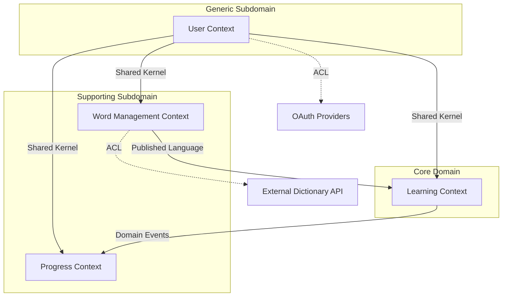

# コンテキストマップ

> **ステータス**: 🔄 ドラフト - 実際の境界づけられたコンテキストは探索セッションで決定

## 境界づけられたコンテキスト一覧

### 1. Learning Context（学習コンテキスト）

**責務**: 学習の最適化とパーソナライゼーション（コアドメイン）

**主要な概念**:

- Learning Session（学習セッション）
- Learning Algorithm（学習アルゴリズム）
- Spaced Repetition（間隔反復）
- Memory Strength（記憶強度）

### 2. Word Management Context（単語管理コンテキスト）

**責務**: 単語情報の管理と協調編集

**主要な概念**:

- Word（単語）
- Meaning（意味）
- Example（例文）
- Collaborative Editing（協調編集）

### 3. User Context（ユーザーコンテキスト）

**責務**: ユーザー管理と認証

**主要な概念**:

- User（ユーザー）
- Authentication（認証）
- Profile（プロフィール）
- Settings（設定）

### 4. Progress Context（進捗コンテキスト）

**責務**: 学習進捗の追跡と分析

**主要な概念**:

- Learning Progress（学習進捗）
- Statistics（統計）
- Achievement（達成）
- Streak（連続記録）

## コンテキストマップ図



## 統合パターンの詳細

### User Context → Other Contexts

**パターン**: Shared Kernel（共有カーネル）

**共有されるもの**:

```rust
// Shared kernel
pub struct UserId(Uuid);
pub struct UserInfo {
    pub id: UserId,
    pub display_name: String,
}
```

**理由**:

- ユーザー情報は全コンテキストで必要
- 変更頻度が低い
- シンプルな構造

### Word Management → Learning Context

**パターン**: Published Language（公開ホスト言語）

**インターフェース**:

```rust
// Word Management が公開する API
trait WordRepository {
    async fn get_word(&self, id: WordId) -> Result<WordData>;
    async fn get_words_for_learning(&self, criteria: LearningCriteria) -> Result<Vec<WordData>>;
}

// 標準化されたデータ構造
pub struct WordData {
    pub id: WordId,
    pub text: String,
    pub meanings: Vec<MeaningData>,
    pub difficulty: u8,
    pub categories: Vec<Category>,
}
```

**理由**:

- Learning Context は Word の詳細に依存しない
- 安定したインターフェース
- 将来の拡張性

### Learning Context → Progress Context

**パターン**: Domain Events（ドメインイベント）

**イベント例**:

```rust
pub enum LearningEvent {
    SessionStarted {
        session_id: SessionId,
        user_id: UserId,
        words: Vec<WordId>,
    },
    QuestionAnswered {
        session_id: SessionId,
        word_id: WordId,
        is_correct: bool,
        response_time_ms: u32,
    },
    SessionCompleted {
        session_id: SessionId,
        results: SessionResults,
    },
}
```

**理由**:

- 非同期で疎結合
- Progress は Learning の結果のみに関心
- イベントソーシングとの親和性

### External Integrations

**パターン**: Anti-Corruption Layer（腐敗防止層）

**Dictionary API との統合**:

```rust
// ACL の実装
pub struct DictionaryAdapter {
    client: ExternalDictionaryClient,
}

impl DictionaryAdapter {
    pub async fn fetch_pronunciation(&self, word: &str) -> Result<Pronunciation> {
        // 外部 API の形式を内部ドメインモデルに変換
        let external_data = self.client.get_word_info(word).await?;
        self.convert_to_domain_model(external_data)
    }
}
```

**理由**:

- 外部システムの変更から保護
- ドメインモデルの純粋性維持
- テスタビリティの向上

## チーム構造との対応

現在は個人開発ですが、将来的なチーム分割を考慮：

| Context         | チーム         | 責任                   |
| --------------- | -------------- | ---------------------- |
| Learning        | Algorithm Team | 学習アルゴリズムの改善 |
| Word Management | Content Team   | コンテンツの品質管理   |
| User            | Platform Team  | 認証・インフラ         |
| Progress        | Analytics Team | データ分析・可視化     |

## 進化戦略

### 短期（MVP）

- 最小限の統合
- 同期的な通信
- モノリシックなデプロイ

### 中期

- イベント駆動への移行
- マイクロサービス化
- 非同期通信の導入

### 長期

- 完全な自律性
- サービスメッシュ
- 分散トランザクション

## リスクと対策

### リスク 1: 過度な分離

**対策**: MVP では必要最小限の分離に留める

### リスク 2: 統合の複雑性

**対策**: シンプルな統合パターンから開始

### リスク 3: データの一貫性

**対策**: イベントソーシングによる結果整合性

## 更新履歴

- 2025-07-25: 初版作成
