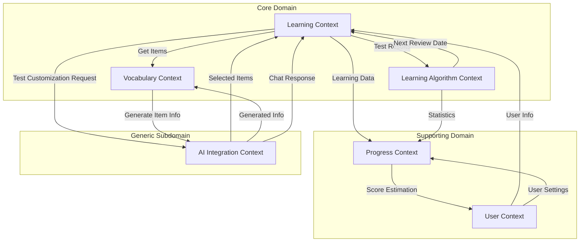

# コンテキストマップ

## 概要

Effect プロジェクトにおける6つの境界づけられたコンテキスト間の関係性を示します。

## コンテキスト関係図



## 関係性の詳細

### 1. User Context の関係

#### → Learning Context

- **関係パターン**: Customer-Supplier
- **内容**: ユーザー情報（ID、学習設定）を提供
- **統合方式**: 同期API

#### → Progress Context

- **関係パターン**: Customer-Supplier
- **内容**: ユーザー設定（目標スコア、コース）を提供
- **統合方式**: 同期API

### 2. Learning Context の関係

#### → Vocabulary Context

- **関係パターン**: Customer-Supplier
- **内容**: テストに必要な項目情報を要求
- **統合方式**: 同期API
- **備考**: Learning は Vocabulary の顧客として項目データを利用

#### → AI Integration Context

- **関係パターン**: Event-Driven Customer-Supplier（将来実装）
- **内容**: テストカスタマイズ要求（"Speaking項目多めで"など）
- **統合方式**: 非同期イベント駆動
- **備考**:
  - 現時点では未実装
  - 将来的にAIがテスト項目を選定
  - タスクIDによる非同期処理管理

#### → Learning Algorithm Context

- **関係パターン**: Customer-Supplier
- **内容**: テスト結果（反応、反応時間）を送信
- **統合方式**: イベント駆動

#### → Progress Context

- **関係パターン**: Publisher-Subscriber
- **内容**: 学習データ（テスト完了イベント）を発行
- **統合方式**: イベント駆動

### 3. Learning Algorithm Context の関係

#### → Learning Context

- **関係パターン**: Customer-Supplier
- **内容**: 次回復習日、復習対象項目を提供
- **統合方式**: 同期API

#### → Progress Context

- **関係パターン**: Customer-Supplier
- **内容**: 計算された統計情報を提供
- **統合方式**: イベント駆動

### 4. Vocabulary Context の関係

#### → AI Integration Context

- **関係パターン**: Event-Driven Partnership
- **内容**: 項目情報生成を要求、タスクIDを受領
- **統合方式**: 非同期イベント駆動（タスクキュー経由）
- **備考**:
  - 即座にタスクIDを返却
  - WebSocket/SSE でリアルタイム進捗通知
  - AI Integration は生データを返し、Vocabulary が自モデルに変換

### 5. AI Integration Context の関係

#### → Learning Context

- **関係パターン**: Event-Driven Service Provider
- **内容**:
  - 選定されたテスト項目（将来実装）
  - 深掘りチャットの応答（将来実装）
- **統合方式**: 非同期イベント駆動
- **備考**: 現時点では直接連携なし、将来の拡張として検討

#### → Vocabulary Context

- **関係パターン**: Event-Driven Service Provider
- **内容**: 生成された項目情報（無加工データ）
- **統合方式**: 非同期イベント駆動
- **備考**:
  - TaskCompleted イベントで結果通知
  - WebSocket/SSE でリアルタイム更新

### 6. Progress Context の関係

#### → User Context

- **関係パターン**: Customer-Supplier
- **内容**: 推定IELTSスコア、進捗レポート
- **統合方式**: 同期API
- **備考**: 単純計算によるスコア推定から開始

## ドメインの分類

### Core Domain（コアドメイン）

#### Learning Context

- **分類理由**: 学習体験の中核であり、ビジネス価値の源泉
- **差別化要因**:
  - ハイブリッド UI（解答表示 → 3秒自動確認）による「覚えた感」の実現
  - 学習セッションの流れとユーザー体験の最適化
  - 他の英語学習アプリとの最大の差別化ポイント

#### Learning Algorithm Context

- **分類理由**: 学習効果を最大化する独自アルゴリズムの実装
- **差別化要因**:
  - SM-2 アルゴリズムの効果的な実装
  - 85% ルールによる動的な難易度調整
  - 個人の学習パターンに最適化された項目選定

#### Vocabulary Context

- **分類理由**: 高品質な学習コンテンツがビジネス成功の前提条件
- **差別化要因**:
  - 試験対策に特化した語彙データベース（IELTS、TOEFL等）
  - Wikipedia スタイルの複数意味管理
  - AI による例文生成と品質管理

### Supporting Domain（支援ドメイン）

#### User Context

- **分類理由**: コアドメインを支える必須機能だが、独自性は低い
- **役割**: ユーザー管理と学習設定の保持
- **実装方針**: シンプルで確実な実装を優先

#### Progress Context

- **分類理由**: 学習モチベーション維持に重要だが、汎用的な集計機能
- **役割**: 学習データの可視化と分析
- **実装方針**: CQRS/Event Sourcing による柔軟な集計

### Generic Subdomain（汎用サブドメイン）

#### AI Integration Context

- **分類理由**: AI サービス自体は外部依存で、統合層は汎用的
- **役割**: 各種 AI サービスの抽象化と統合
- **実装方針**: 既存の AI サービスを効率的に活用

## 統合パターンの方針

1. **イベント駆動を優先**
   - 疎結合を実現
   - 非同期処理による性能向上

2. **Anti-Corruption Layer の適用**
   - AI Integration からのデータは各コンテキストで変換
   - 外部モデルから内部モデルを保護

3. **Published Language**
   - ドメインイベントを共通言語として定義
   - 各コンテキスト間の契約を明確化

## 共有される概念

### Shared Kernel（共有カーネル）

```rust
// 全コンテキストで共有される識別子
pub struct UserId(Uuid);
pub struct ItemId(Uuid);
pub struct SessionId(Uuid);

// 基本的な値オブジェクト
pub struct CourseType(String); // IELTS, TOEFL, etc.
pub struct CefrLevel(String);  // A1, A2, B1, B2, C1, C2
```

## ドメインイベント

### Learning Context が発行するイベント

```rust
pub enum LearningEvent {
    TestStarted {
        session_id: SessionId,
        user_id: UserId,
        item_count: usize,
    },
    UserResponded {
        session_id: SessionId,
        item_id: ItemId,
        response: ResponseType,
        response_time_ms: u32,
    },
    ItemMastered {
        user_id: UserId,
        item_id: ItemId,
        mastered_at: DateTime<Utc>,
    },
    SessionCompleted {
        session_id: SessionId,
        correct_count: usize,
        total_count: usize,
    },
}
```

### Vocabulary Context が発行するイベント

```rust
pub enum VocabularyEvent {
    ItemRegistered {
        item_id: ItemId,
        spelling: String,
        created_by: CreatedBy,
    },
    ItemInfoGenerated {
        item_id: ItemId,
        generated_at: DateTime<Utc>,
    },
}
```

## 今後の検討事項

1. **イベントストアの導入**
   - Learning Context のイベントを永続化
   - 監査証跡とイベントソーシング

2. **API Gateway の検討**
   - 外部向けAPIの統一インターフェース
   - 認証・認可の一元管理

3. **サービスメッシュの評価**
   - マイクロサービス間通信の管理
   - 可観測性の向上

## 更新履歴

- 2025-07-27: 初版作成（6つのコンテキストの関係性を定義）
