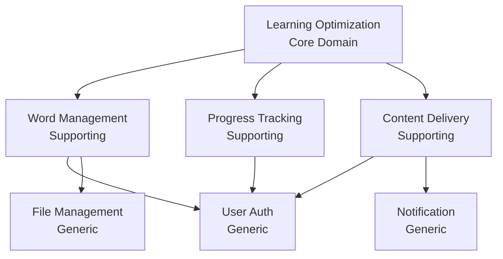

# ドメインタイプ

## コアドメイン（Core Domain）

### 学習最適化ドメイン

**Effect の競争優位性の源泉**

#### 含まれる機能

- **SM-2 アルゴリズムの実装**

  - 個人の記憶パターンへの適応
  - 最適な復習タイミングの計算
  - 難易度の動的調整

- **パーソナライズされた学習体験**

  - 個人の学習ペースに合わせた調整
  - 苦手分野の特定と強化
  - 学習習慣の形成支援

- **学習効果の最大化**
  - エビングハウスの忘却曲線への対応
  - アクティブリコールの実装
  - 間隔反復の最適化

#### なぜコアドメインなのか

- 他の英語学習アプリとの差別化要因
- ユーザーが Effect を選ぶ理由
- 最も投資すべき領域

## サポーティングサブドメイン（Supporting Subdomain）

### 1. 単語管理ドメイン

**コアドメインを支える重要な機能**

#### 含まれる機能

- 単語の登録・編集・削除
- 意味、例文、発音の管理
- カテゴリとタグによる分類
- 関連語の管理

#### 特徴

- Effect 特有のビジネスロジックを含む
- 協調編集機能による差別化
- 品質の高いコンテンツ管理

### 2. 進捗追跡ドメイン

**学習の可視化と動機づけ**

#### 含まれる機能

- 学習履歴の記録
- 統計情報の集計
- ストリーク管理
- 目標設定と達成度

#### 特徴

- ユーザーの動機づけに直結
- データ分析の基盤
- 学習改善のフィードバック

### 3. 学習コンテンツ配信ドメイン

**実際の学習体験の提供**

#### 含まれる機能

- 問題の生成と提示
- 回答の評価
- ヒントの提供
- 学習モードの切り替え

#### 特徴

- ユーザーインターフェースに近い
- 様々な学習形式への対応
- リアルタイムな反応

## ジェネリックサブドメイン（Generic Subdomain）

### 1. ユーザー認証・認可ドメイン

**一般的な機能**

#### 含まれる機能

- ユーザー登録・ログイン
- パスワード管理
- セッション管理
- 権限管理

#### 対応方針

- 既存のライブラリやサービスを活用
- 最小限のカスタマイズ
- 標準的なセキュリティプラクティス

### 2. 通知ドメイン

**汎用的な通知機能**

#### 含まれる機能

- 復習リマインダー
- 達成通知
- システム通知

#### 対応方針

- 既存の通知サービスの利用
- シンプルな実装
- 必要最小限の機能

### 3. ファイル管理ドメイン

**音声や画像の管理**

#### 含まれる機能

- ファイルのアップロード
- ストレージ管理
- CDN 配信

#### 対応方針

- クラウドストレージサービスの利用
- 標準的な実装パターン

## ドメイン間の関係

## 投資戦略

### 高投資（コアドメイン）

- 最高品質のコード
- 徹底的なテスト
- 継続的な改善
- ドメインエキスパートの関与

### 中投資（サポーティングサブドメイン）

- 良質なコード
- 適切なテストカバレッジ
- 定期的なリファクタリング
- ビジネス要件への迅速な対応

### 低投資（ジェネリックサブドメイン）

- 既製品の活用
- 最小限のカスタマイズ
- 基本的なテスト
- 安定性重視

## 進化の方向性

### コアドメインの進化

1. より高度な学習アルゴリズム
2. AI による個人最適化
3. 認知科学の最新知見の反映

### サポーティングサブドメインの進化

1. より豊富なコンテンツ
2. コミュニティ機能の追加
3. 詳細な分析機能

### ジェネリックサブドメインの進化

1. 最新のセキュリティ対応
2. パフォーマンスの改善
3. より良い UX

## 更新履歴

- 2025-07-25: 初版作成
