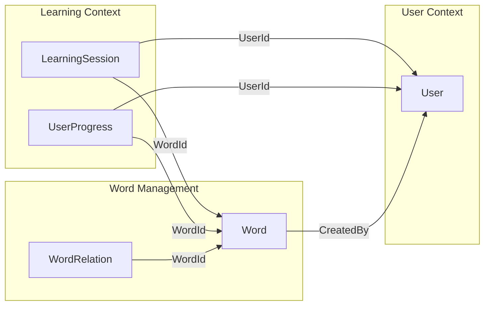

# アグリゲート設計

## 概要

このドキュメントでは、Effect の各境界づけられたコンテキストにおけるアグリゲートの詳細設計を記述します。

## アグリゲート設計の原則

1. **一貫性境界**: トランザクション整合性が必要な範囲
2. **不変条件**: ビジネスルールを常に満たす
3. **小さく保つ**: パフォーマンスと理解しやすさのため
4. **ID による参照**: アグリゲート間は ID で参照

## Learning Context のアグリゲート

### LearningSession Aggregate

**責務**: 学習セッションのライフサイクル管理

```rust
// アグリゲートルート
pub struct LearningSession {
    // Identity
    id: SessionId,

    // Properties
    user_id: UserId,
    started_at: DateTime<Utc>,
    completed_at: Option<DateTime<Utc>>,

    // Entities
    questions: Vec<Question>,

    // Value Objects
    config: SessionConfig,
    state: SessionState,

    // Aggregate specific
    version: u64,
}

// エンティティ
pub struct Question {
    id: QuestionId,
    word_id: WordId,
    question_type: QuestionType,
    presented_at: DateTime<Utc>,
    answer: Option<Answer>,
}

// 値オブジェクト
pub struct Answer {
    submitted_at: DateTime<Utc>,
    content: String,
    is_correct: bool,
    response_time_ms: u32,
}

pub struct SessionConfig {
    mode: LearningMode,
    word_count: u32,
    time_limit: Option<Duration>,
}

// アグリゲートのメソッド
impl LearningSession {
    // ファクトリメソッド
    pub fn start(
        user_id: UserId,
        word_ids: Vec<WordId>,
        config: SessionConfig,
    ) -> Result<Self, DomainError> {
        if word_ids.is_empty() {
            return Err(DomainError::NoWordsSelected);
        }

        if word_ids.len() > 100 {
            return Err(DomainError::TooManyWords);
        }

        Ok(Self {
            id: SessionId::new(),
            user_id,
            started_at: Utc::now(),
            completed_at: None,
            questions: vec![],
            config,
            state: SessionState::InProgress,
            version: 0,
        })
    }

    // コマンドメソッド
    pub fn generate_question(&mut self, word_id: WordId) -> Result<QuestionId, DomainError> {
        self.ensure_in_progress()?;

        let question = Question {
            id: QuestionId::new(),
            word_id,
            question_type: self.select_question_type(),
            presented_at: Utc::now(),
            answer: None,
        };

        let question_id = question.id;
        self.questions.push(question);

        Ok(question_id)
    }

    pub fn submit_answer(
        &mut self,
        question_id: QuestionId,
        content: String,
        is_correct: bool,
    ) -> Result<(), DomainError> {
        self.ensure_in_progress()?;

        let question = self.questions
            .iter_mut()
            .find(|q| q.id == question_id)
            .ok_or(DomainError::QuestionNotFound)?;

        if question.answer.is_some() {
            return Err(DomainError::AlreadyAnswered);
        }

        let response_time_ms = (Utc::now() - question.presented_at)
            .num_milliseconds() as u32;

        question.answer = Some(Answer {
            submitted_at: Utc::now(),
            content,
            is_correct,
            response_time_ms,
        });

        Ok(())
    }

    pub fn complete(&mut self) -> Result<SessionResult, DomainError> {
        self.ensure_in_progress()?;

        if self.questions.is_empty() {
            return Err(DomainError::NoQuestionsAnswered);
        }

        let answered_questions = self.questions
            .iter()
            .filter(|q| q.answer.is_some())
            .count();

        if answered_questions == 0 {
            return Err(DomainError::NoQuestionsAnswered);
        }

        self.completed_at = Some(Utc::now());
        self.state = SessionState::Completed;

        Ok(self.calculate_result())
    }

    // 不変条件の確認
    fn ensure_in_progress(&self) -> Result<(), DomainError> {
        match self.state {
            SessionState::InProgress => Ok(()),
            _ => Err(DomainError::SessionNotInProgress),
        }
    }
}
```

### UserProgress Aggregate

**責務**: ユーザーの単語ごとの学習進捗管理

```rust
pub struct UserProgress {
    // Identity
    user_id: UserId,
    word_id: WordId,

    // Properties
    first_studied_at: DateTime<Utc>,
    last_reviewed_at: DateTime<Utc>,
    total_reviews: u32,
    correct_count: u32,

    // Value Objects
    sm2_params: SM2Parameters,
    mastery_level: MasteryLevel,

    // Computed
    next_review_date: Date,
}

// SM-2 アルゴリズムのパラメータ
pub struct SM2Parameters {
    repetition_count: u32,
    easiness_factor: f32,  // 1.3 以上
    interval_days: u32,
}

impl UserProgress {
    pub fn create_new(user_id: UserId, word_id: WordId) -> Self {
        Self {
            user_id,
            word_id,
            first_studied_at: Utc::now(),
            last_reviewed_at: Utc::now(),
            total_reviews: 0,
            correct_count: 0,
            sm2_params: SM2Parameters::default(),
            mastery_level: MasteryLevel::new(0.0),
            next_review_date: Utc::today(),
        }
    }

    pub fn record_review(&mut self, quality: QualityRating) -> Result<(), DomainError> {
        self.total_reviews += 1;

        if quality.is_correct() {
            self.correct_count += 1;
        }

        // SM-2 アルゴリズムの適用
        self.sm2_params = self.calculate_next_interval(quality);
        self.next_review_date = Utc::today() + Duration::days(self.sm2_params.interval_days as i64);
        self.last_reviewed_at = Utc::now();

        // 習熟度の更新
        self.mastery_level = self.calculate_mastery_level();

        Ok(())
    }

    fn calculate_next_interval(&self, quality: QualityRating) -> SM2Parameters {
        let mut params = self.sm2_params.clone();

        // SM-2 アルゴリズムの実装
        params.easiness_factor = (params.easiness_factor + 0.1
            - (5.0 - quality.value() as f32) * (0.08 + (5.0 - quality.value() as f32) * 0.02))
            .max(1.3);

        if quality.value() < 3 {
            params.repetition_count = 0;
            params.interval_days = 1;
        } else {
            params.repetition_count += 1;
            params.interval_days = match params.repetition_count {
                1 => 1,
                2 => 6,
                _ => (params.interval_days as f32 * params.easiness_factor) as u32,
            };
        }

        params
    }
}
```

## Word Management Context のアグリゲート

### Word Aggregate

**責務**: 単語情報の管理と協調編集

```rust
pub struct Word {
    // Identity
    id: WordId,

    // Properties
    text: WordText,
    phonetic_ipa: Phonetic,
    phonetic_spelling: Option<PhoneticSpelling>,
    image_url: Option<Url>,

    // Entities
    meanings: Vec<Meaning>,
    examples: Vec<Example>,

    // Value Objects
    metadata: WordMetadata,

    // Concurrency control
    version: u32,
}

// エンティティ
pub struct Meaning {
    id: MeaningId,
    text: String,
    part_of_speech: PartOfSpeech,
    usage_note: Option<String>,
    created_by: UserId,
    created_at: DateTime<Utc>,
}

pub struct Example {
    id: ExampleId,
    meaning_id: MeaningId,
    sentence: String,
    translation: String,
    context: Option<Context>,
    audio_url: Option<Url>,
    created_by: UserId,
    created_at: DateTime<Utc>,
}

// 値オブジェクト
pub struct WordMetadata {
    difficulty: Difficulty,  // 1-10
    cefr_level: CefrLevel,
    categories: Vec<Category>,
    tags: Vec<Tag>,
    created_by: UserId,
    created_at: DateTime<Utc>,
    updated_by: Option<UserId>,
    updated_at: Option<DateTime<Utc>>,
}

impl Word {
    pub fn create(
        text: String,
        initial_meaning: String,
        created_by: UserId,
    ) -> Result<Self, DomainError> {
        let word_text = WordText::new(text)?;

        let meaning = Meaning {
            id: MeaningId::new(),
            text: initial_meaning,
            part_of_speech: PartOfSpeech::Unknown,
            usage_note: None,
            created_by,
            created_at: Utc::now(),
        };

        Ok(Self {
            id: WordId::new(),
            text: word_text,
            phonetic_ipa: Phonetic::empty(),
            phonetic_spelling: None,
            image_url: None,
            meanings: vec![meaning],
            examples: vec![],
            metadata: WordMetadata::new(created_by),
            version: 0,
        })
    }

    pub fn add_meaning(
        &mut self,
        text: String,
        part_of_speech: PartOfSpeech,
        added_by: UserId,
    ) -> Result<MeaningId, DomainError> {
        if self.meanings.len() >= 10 {
            return Err(DomainError::TooManyMeanings);
        }

        // 重複チェック
        if self.meanings.iter().any(|m| m.text == text && m.part_of_speech == part_of_speech) {
            return Err(DomainError::DuplicateMeaning);
        }

        let meaning = Meaning {
            id: MeaningId::new(),
            text,
            part_of_speech,
            usage_note: None,
            created_by: added_by,
            created_at: Utc::now(),
        };

        let meaning_id = meaning.id;
        self.meanings.push(meaning);
        self.increment_version();

        Ok(meaning_id)
    }

    pub fn add_example(
        &mut self,
        meaning_id: MeaningId,
        sentence: String,
        translation: String,
        added_by: UserId,
    ) -> Result<ExampleId, DomainError> {
        // 意味の存在確認
        if !self.meanings.iter().any(|m| m.id == meaning_id) {
            return Err(DomainError::MeaningNotFound);
        }

        // 例文数の制限
        let examples_for_meaning = self.examples
            .iter()
            .filter(|e| e.meaning_id == meaning_id)
            .count();

        if examples_for_meaning >= 5 {
            return Err(DomainError::TooManyExamples);
        }

        let example = Example {
            id: ExampleId::new(),
            meaning_id,
            sentence,
            translation,
            context: None,
            audio_url: None,
            created_by: added_by,
            created_at: Utc::now(),
        };

        let example_id = example.id;
        self.examples.push(example);
        self.increment_version();

        Ok(example_id)
    }

    fn increment_version(&mut self) {
        self.version += 1;
        self.metadata.updated_at = Some(Utc::now());
    }
}
```

### WordRelation Aggregate

**責務**: 単語間の関係性管理

```rust
pub struct WordRelation {
    // Identity
    id: RelationId,

    // Properties
    word_id: WordId,
    related_word_id: WordId,
    relation_type: RelationType,

    // Metadata
    created_by: UserId,
    created_at: DateTime<Utc>,
    confidence_score: f32,  // 0.0-1.0
}

impl WordRelation {
    pub fn create(
        word_id: WordId,
        related_word_id: WordId,
        relation_type: RelationType,
        created_by: UserId,
    ) -> Result<Self, DomainError> {
        if word_id == related_word_id {
            return Err(DomainError::SelfRelation);
        }

        Ok(Self {
            id: RelationId::new(),
            word_id,
            related_word_id,
            relation_type,
            created_by,
            created_at: Utc::now(),
            confidence_score: 1.0,  // 手動作成は信頼度100%
        })
    }
}
```

## User Context のアグリゲート

### User Aggregate

**責務**: ユーザー情報とライフサイクル管理

```rust
pub struct User {
    // Identity
    id: UserId,

    // Properties
    email: Email,
    display_name: DisplayName,

    // Entities
    profile: UserProfile,
    settings: UserSettings,

    // Value Objects
    auth_info: AuthInfo,
    account_status: AccountStatus,
}

pub struct UserProfile {
    bio: Option<String>,
    avatar_url: Option<Url>,
    timezone: Timezone,
    language: Language,
    learning_goals: Vec<LearningGoal>,
}

pub struct UserSettings {
    daily_goal: DailyGoal,
    notification_enabled: bool,
    reminder_time: Option<Time>,
    preferred_categories: Vec<Category>,
    sound_enabled: bool,
    dark_mode: bool,
}

impl User {
    pub fn register(
        email: String,
        display_name: String,
        auth_method: AuthMethod,
    ) -> Result<Self, DomainError> {
        let email = Email::parse(email)?;
        let display_name = DisplayName::new(display_name)?;

        Ok(Self {
            id: UserId::new(),
            email,
            display_name,
            profile: UserProfile::default(),
            settings: UserSettings::default(),
            auth_info: AuthInfo::new(auth_method),
            account_status: AccountStatus::Active,
        })
    }

    pub fn update_profile(&mut self, updates: ProfileUpdates) -> Result<(), DomainError> {
        if let Some(bio) = updates.bio {
            self.profile.bio = Some(bio);
        }

        if let Some(goals) = updates.learning_goals {
            if goals.len() > 5 {
                return Err(DomainError::TooManyGoals);
            }
            self.profile.learning_goals = goals;
        }

        Ok(())
    }
}
```

## アグリゲート間の関係



## 設計上の決定事項

### なぜこの境界なのか

1. **LearningSession**: セッション中の一貫性が重要
2. **UserProgress**: 個人の進捗は独立して管理
3. **Word**: 協調編集の単位として適切
4. **User**: 認証・認可の境界と一致

### パフォーマンス考慮

1. **小さなアグリゲート**: ロック競合を最小化
2. **ID による参照**: 結合を避ける
3. **イベントソーシング**: 履歴管理の効率化

## 更新履歴

- 2025-07-25: 初版作成
