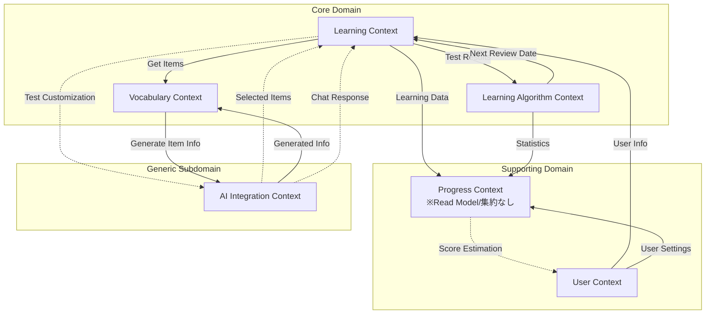

# コンテキストマップ

## 概要

Effect プロジェクトにおける 6 つの境界づけられたコンテキスト間の関係性を示します。

## コンテキスト関係図

DDD の統合パターンを含む詳細な図は [context-map.puml](./context-map.puml) を参照してください。

### 簡易図

## 統合パターン一覧

| From                       | To                         | パターン           | 統合方式          | 実装状況 |
| -------------------------- | -------------------------- | ------------------ | ----------------- | -------- |
| User Context               | Learning Context           | Customer-Supplier  | 同期 API          | 実装済み |
| User Context               | Progress Context           | Customer-Supplier  | 同期 API          | 実装済み |
| Learning Context           | Vocabulary Context         | Customer-Supplier  | 同期 API          | 実装済み |
| Learning Context           | AI Integration Context     | Event-Driven Partnership | 非同期イベント    | 将来実装 |
| Learning Context           | Learning Algorithm Context | Partnership        | 同期 API/イベント | 実装済み |
| Learning Context           | Progress Context           | Published Language | イベント駆動（送信のみ） | 実装済み |
| Learning Algorithm Context | Progress Context           | Published Language | イベント駆動（送信のみ） | 実装済み |
| Vocabulary Context         | AI Integration Context     | Partnership + ACL  | 非同期イベント    | 実装済み |
| Progress Context           | User Context               | Customer-Supplier  | 同期 API          | 将来実装 |

## Anti-Corruption Layer (ACL) の適用箇所

- **Vocabulary Context ↔ AI Integration Context**: 外部 AI サービスのデータ形式から内部モデルを保護
- **AI Integration Context 全般**: すべての外部 AI サービスとの境界に ACL を配置

## 統合パターンの方針

1. **イベント駆動を優先**: 疎結合と非同期処理による性能向上
2. **Anti-Corruption Layer の適用**: 外部サービスから内部モデルを保護
3. **Published Language**: ドメインイベントを共通言語として定義
4. **Progress Context の特殊性**: 純粋な Read Model として、イベント受信専用（集約なし）

## 関連ドキュメント

- ドメイン分類の詳細: `/docs/strategic/domain-classification.md`
- 各コンテキストの詳細: `/docs/tactical/contexts/*/canvas.md`
- 共有概念の定義: `/docs/tactical/shared/kernel.md`
- ドメインイベント: `/docs/tactical/contexts/*/events.md`
- 統合パターン: `/docs/tactical/integration/patterns.md`

## 更新履歴

- 2025-07-30: PlantUML 版を正式な詳細図として採用、Mermaid は簡易図として維持
- 2025-07-30: ドキュメントを簡素化、詳細を各専門ドキュメントに委譲
- 2025-07-30: AI Integration Context を Event-Driven Partnership に更新
- 2025-07-27: 初版作成
