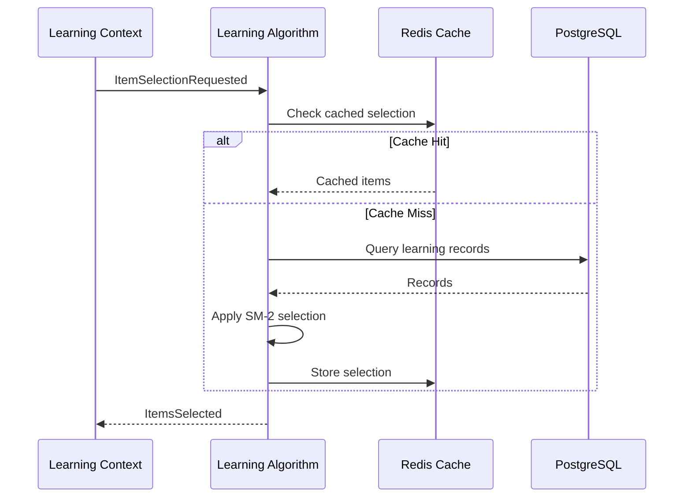
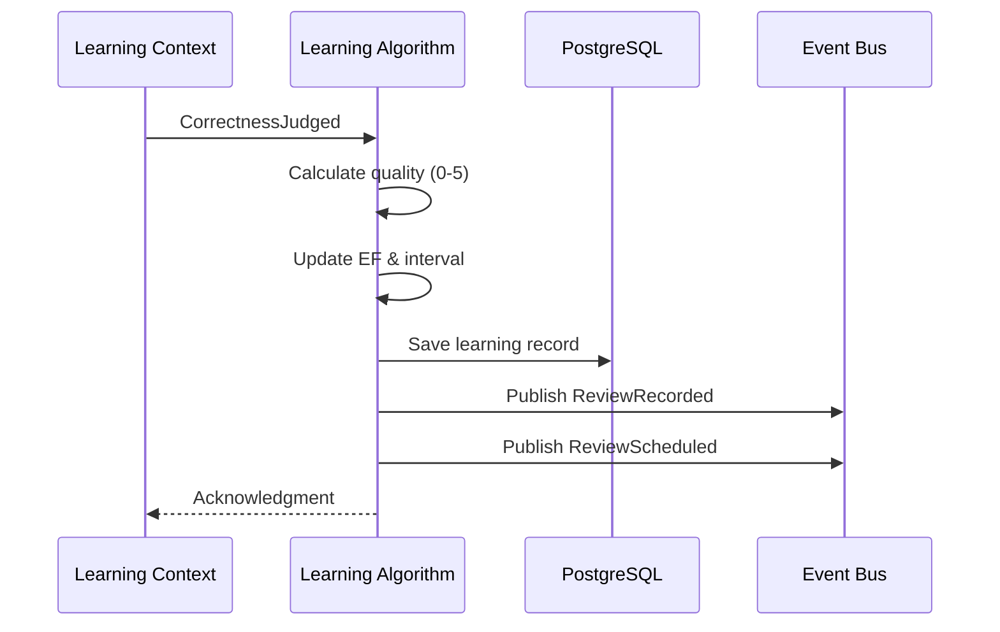

# Learning Algorithm Context - アーキテクチャ

## 概要

Learning Algorithm Context は SM-2（SuperMemo 2）アルゴリズムを基盤とした学習最適化システムです。単一サービスアーキテクチャで、高速な項目選定と復習スケジューリングを実現します。

## アーキテクチャパターン

### 単一サービスアーキテクチャ

```
┌─────────────────────────────────────────────────────────┐
│                    API Layer                              │
│                 (Internal gRPC API)                       │
└────────────────────────┬───────────────────────────────┘
                         │
┌────────────────────────┴───────────────────────────────┐
│                  Application Layer                       │
│         (Commands, Queries, Event Handlers)              │
└────────────────────────┬───────────────────────────────┘
                         │
┌────────────────────────┴───────────────────────────────┐
│                    Domain Layer                          │
│     (ItemLearningRecord, SM2Calculator, Analyzer)        │
└────────────────────────┬───────────────────────────────┘
                         │
┌────────────────────────┴───────────────────────────────┐
│                 Infrastructure Layer                     │
│              (PostgreSQL, Redis, Pub/Sub)               │
└─────────────────────────────────────────────────────────┘
```

### レイヤー責務

1. **API Layer**
   - 内部 gRPC API（他のコンテキストからの呼び出し）
   - リクエスト/レスポンスの変換
   - エラーハンドリング

2. **Application Layer**
   - コマンド/クエリのハンドリング
   - イベント処理
   - トランザクション管理

3. **Domain Layer**
   - SM-2 アルゴリズムの実装
   - 項目選定ロジック
   - パフォーマンス分析

4. **Infrastructure Layer**
   - データ永続化
   - キャッシング
   - イベント発行

## コアコンポーネント

### SM-2 Calculator

**責務**: SM-2 アルゴリズムによる復習間隔と難易度係数の計算

**主要な計算**:

- 次回復習間隔の計算
- 難易度係数（EF）の更新
- 品質評価の決定

**アルゴリズムの原理**:

- 忘却曲線に基づく最適なタイミング
- 個人の記憶特性への適応
- 反応時間を考慮した品質評価

### Item Selector

**責務**: 学習セッションのための最適な項目選定

**選定戦略**:

- 期限切れ項目の優先処理
- 新規項目と復習項目のバランス（1:4）
- 難易度の適切な分散
- 85%ルールに基づく調整

**最適化の考慮事項**:

- 認知負荷の分散
- 学習効率の最大化
- ユーザーの集中力維持

### Performance Analyzer

**責務**: 学習パフォーマンスの分析と最適化

**分析内容**:

- 正答率のトレンド分析
- 学習速度の計測
- 最適難易度の算出
- 学習パターンの検出

**85%ルール**:

- 認知科学研究に基づく最適正答率
- 動的な難易度調整のトリガー
- 学習効果の最大化

### Schedule Manager

**責務**: 復習スケジュールの管理

**機能**:

- 次回復習日の計算
- スケジュールの最適化
- 期限切れ項目の管理
- バッチ更新の処理

## データフロー

### 項目選定フロー



### 復習記録フロー



## SM-2 アルゴリズムの理論

### 基本原理

SM-2 は間隔反復法（Spaced Repetition）の実装で、以下の原理に基づいています：

1. **忘却曲線**: エビングハウスの忘却曲線に基づく記憶の減衰モデル
2. **最適復習タイミング**: 忘れかけた時点での復習が最も効果的
3. **個別適応**: 項目ごと、ユーザーごとの難易度調整

### 品質評価システム

反応時間と正誤から品質（0-5）を決定：

| 品質 | 条件 | 意味 |
|------|------|------|
| 5 | 即答（<3秒）かつ正解 | 完璧な記憶 |
| 4 | 素早い（<10秒）かつ正解 | 良好な記憶 |
| 3 | 標準（<30秒）かつ正解 | 十分な記憶 |
| 2 | 遅い（≥30秒）かつ正解 | 弱い記憶 |
| 1 | 不正解だが部分的 | 不完全な記憶 |
| 0 | 完全に不正解 | 記憶なし |

### 難易度係数（EF）

- 範囲: 1.3 〜 2.5
- 初期値: 2.5
- 品質評価に基づいて動的に調整
- 個人の学習特性を反映

## パフォーマンス最適化

### レスポンスタイム目標

| 操作 | 目標時間 |
|------|----------|
| 項目選定 | <100ms |
| 復習記録 | <50ms |
| スケジュール計算 | <20ms |
| パフォーマンス分析 | <500ms |

### キャッシング戦略

**Redis によるキャッシング**:

- 項目選定結果: 5分間
- ユーザーパフォーマンス: 30分間
- 統計データ: 1時間

### データベース最適化

**インデックス設計**:

- 複合インデックス: (user_id, next_review_date)
- 部分インデックス: status = 'Review'
- カバリングインデックス: 頻繁なクエリ用

## 他コンテキストとの連携

### Learning Context

**関係性**: Partnership（双方向の密接な協調）

**やり取り**:

- 受信: CorrectnessJudged, ItemSelectionRequested
- 送信: ItemsSelected, ReviewScheduled

### Progress Context

**関係性**: Publisher（イベント発行）

**発行イベント**:

- ReviewRecorded
- DifficultyAdjusted
- PerformanceAnalyzed

### User Context

**関係性**: Consumer（設定の受信）

**受信内容**:

- 学習設定の変更
- ユーザープリファレンス

## セキュリティ考慮事項

1. **データアクセス制御**
   - ユーザーは自分のデータのみアクセス可能
   - 内部 API のみ（外部公開なし）

2. **データ保護**
   - 学習記録の暗号化（at rest）
   - TLS による通信暗号化（in transit）

3. **監査ログ**
   - アルゴリズム調整の記録
   - パフォーマンス分析の履歴

## 拡張ポイント

### 将来のアルゴリズム対応

現在は SM-2 を使用していますが、以下への拡張を考慮：

- SM-18: より高度な SuperMemo アルゴリズム
- FSRS: Free Spaced Repetition Scheduler
- 機械学習ベースの最適化

### A/Bテスト機能

- アルゴリズムパラメータの実験
- ユーザーグループごとの比較
- 効果測定と自動最適化
