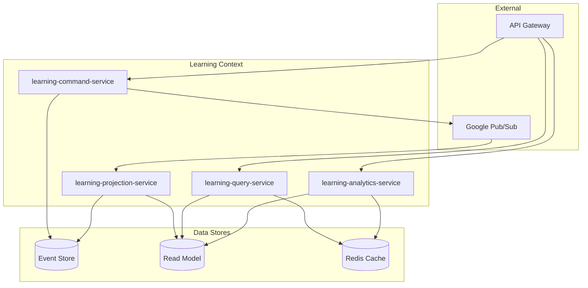

# Learning Context - サービスアーキテクチャ

## 概要

Learning Context は CQRS (Command Query Responsibility Segregation) と Event Sourcing パターンを採用し、4つのマイクロサービスに分解されています。これにより、学習体験の最適化、高い可用性、そして柔軟なスケーリングを実現しています。

## マイクロサービス構成



## 1. learning-command-service

### 責務

- 学習セッションの作成と管理
- 項目の提示と正誤判定
- ドメインイベントの生成
- Event Store への永続化

### 主要機能

1. **セッション管理**
   - StartSession: 新規セッション開始
   - CompleteSession: セッション完了
   - AbandonSession: セッション中断

2. **学習フロー制御**
   - PresentItem: 項目提示
   - RevealAnswer: 解答表示
   - JudgeCorrectness: 正誤判定

3. **イベント生成**
   - SessionStarted
   - ItemPresented
   - CorrectnessJudged
   - SessionCompleted

### 技術スタック

- 言語: Rust
- フレームワーク: Axum
- Event Store: PostgreSQL
- メッセージング: Google Pub/Sub

### 外部連携

- Algorithm Context: 項目選定（同期 gRPC）
- Vocabulary Context: 項目詳細取得（同期 gRPC）

## 2. learning-query-service

### 責務

- Read Model からのデータ取得
- 学習情報の検索とフィルタリング
- キャッシュ管理
- GraphQL API の提供

### 主要機能

1. **セッション情報**
   - アクティブセッション取得
   - セッション履歴検索
   - セッション統計

2. **学習記録**
   - 習熟度別項目取得
   - 復習スケジュール管理
   - 学習進捗追跡

3. **キャッシュ戦略**
   - Redis による高速化
   - TTL: 5分（頻繁更新データ）
   - TTL: 1時間（統計データ）

### 技術スタック

- 言語: Rust
- フレームワーク: Axum
- データベース: PostgreSQL (Read Model)
- キャッシュ: Redis

## 3. learning-projection-service

### 責務

- イベントの消費と処理
- Read Model の更新
- 他コンテキストへのイベント転送
- 習熟度の計算と更新

### 主要機能

1. **イベント処理**
   - Event Store からのイベント読み取り
   - イベントハンドラーの実行
   - 冪等性の保証

2. **投影処理**
   - セッションビューの作成/更新
   - 学習記録の集計
   - 統計情報の計算

3. **イベント転送**
   - Progress Context への通知
   - Algorithm Context への学習結果送信

### 技術スタック

- 言語: Rust
- メッセージング: Google Pub/Sub
- データベース: PostgreSQL

### 処理フロー

```rust
// イベントハンドラーの例
async fn handle_session_completed(event: SessionCompleted) {
    // 1. Read Model の更新
    update_session_view(&event).await?;
    
    // 2. 統計情報の再計算
    recalculate_user_stats(&event.user_id).await?;
    
    // 3. Progress Context への転送
    publish_to_progress_context(&event).await?;
}
```

## 4. learning-analytics-service

### 責務

- 学習パターンの分析
- パフォーマンス指標の計算
- 学習推奨の生成
- レポート機能の提供

### 主要機能

1. **学習分析**
   - 学習曲線の生成
   - 正答率トレンド分析
   - 時間帯別パフォーマンス

2. **推奨機能**
   - 最適な学習時間の提案
   - 苦手項目の特定
   - 学習戦略の最適化

3. **レポート生成**
   - 週次/月次レポート
   - 進捗ダッシュボード
   - カスタムレポート

### 技術スタック

- 言語: Rust
- 分析: Apache Arrow/DataFusion
- キャッシュ: Redis（長期TTL）

## データフロー

### 1. コマンドフロー（書き込み）

```
User Request → API Gateway → Command Service
                                ↓
                            Event Store
                                ↓
                            Pub/Sub → Projection Service
                                         ↓
                                    Read Model
```

### 2. クエリフロー（読み取り）

```
User Request → API Gateway → Query Service
                                ↓
                        Redis Cache (hit) → Response
                                ↓ (miss)
                            Read Model → Response
```

### 3. 分析フロー

```
Read Model → Analytics Service → Processing
                                     ↓
                                Redis Cache → API Response
```

## スケーリング戦略

### 1. Command Service

- 最小インスタンス: 2
- 最大インスタンス: 10
- スケーリング基準: CPU使用率、リクエスト数

### 2. Query Service

- 最小インスタンス: 3
- 最大インスタンス: 20
- スケーリング基準: レスポンスタイム、同時接続数

### 3. Projection Service

- 最小インスタンス: 2
- 最大インスタンス: 5
- スケーリング基準: メッセージキューの深さ

### 4. Analytics Service

- 最小インスタンス: 1
- 最大インスタンス: 5
- スケーリング基準: 計算負荷

## 障害対策

### 1. サーキットブレーカー

```rust
// 外部サービス呼び出し時の保護
let items = circuit_breaker
    .call(|| algorithm_service.select_items())
    .await
    .unwrap_or_else(|_| fallback_selection());
```

### 2. リトライ戦略

- 指数バックオフ
- 最大リトライ回数: 3
- デッドレターキュー

### 3. グレースフルデグラデーション

- Query Service 障害時: キャッシュのみで応答
- Analytics Service 障害時: 基本機能は継続
- Projection Service 遅延時: 結果整合性で対応

## モニタリング

### メトリクス

1. **ビジネスメトリクス**
   - セッション完了率
   - 平均正答率
   - 学習継続率

2. **技術メトリクス**
   - レスポンスタイム（p50, p95, p99）
   - エラー率
   - イベント処理遅延

### ログ

- 構造化ログ（JSON）
- トレースID による分散トレーシング
- Google Cloud Logging への集約

### アラート

- セッション完了率 < 70%
- レスポンスタイム p99 > 500ms
- イベント処理遅延 > 5秒
