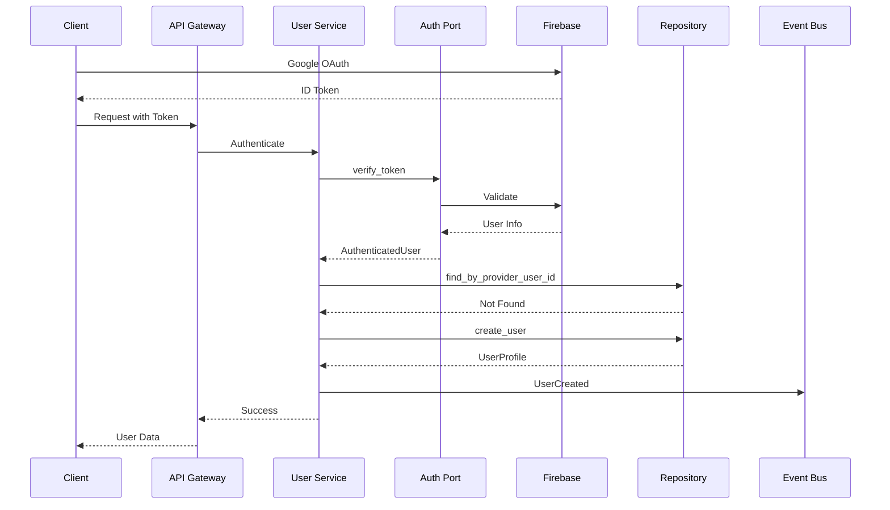
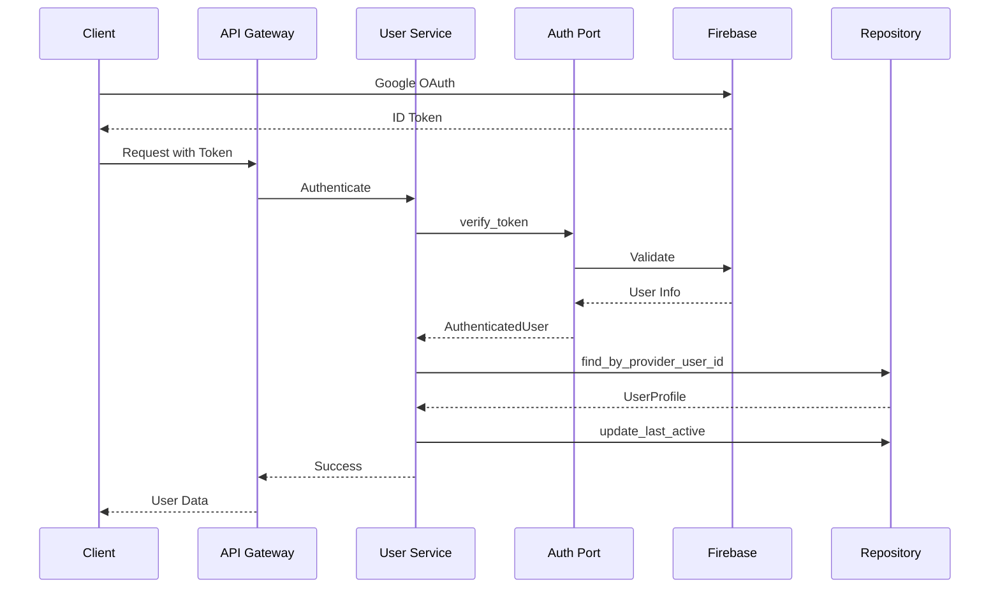

# User Context - アーキテクチャ

## 概要

User Context のアーキテクチャ設計です。ポート&アダプターパターンにより認証プロバイダーを抽象化し、将来的な拡張性を確保しています。

## アーキテクチャパターン

### ポート&アダプターアーキテクチャ

```
┌─────────────────────────────────────────────────────────┐
│                    Presentation Layer                     │
│                    (GraphQL API)                          │
└────────────────────────┬───────────────────────────────┘
                         │
┌────────────────────────┴───────────────────────────────┐
│                    Application Layer                     │
│              (Commands, Queries, Services)               │
└────────────────────────┬───────────────────────────────┘
                         │
┌────────────────────────┴───────────────────────────────┐
│                     Domain Layer                         │
│             (UserProfile, Events, Ports)                 │
└────────────────────────┬───────────────────────────────┘
                         │
         ┌───────────────┴───────────────┐
         │                               │
┌────────┴────────┐           ┌──────────┴──────────┐
│ Infrastructure  │           │   Authentication    │
│   Repository    │           │      Adapter        │
│  (PostgreSQL)   │           │    (Firebase)       │
└─────────────────┘           └─────────────────────┘
```

### レイヤー責務

1. **Presentation Layer**
   - GraphQL スキーマの定義
   - 認証トークンの受け取り
   - レスポンスのフォーマット

2. **Application Layer**
   - コマンド/クエリのハンドリング
   - トランザクション管理
   - イベント発行

3. **Domain Layer**
   - ビジネスロジック
   - UserProfile 集約
   - AuthenticationPort インターフェース

4. **Infrastructure Layer**
   - データベースアクセス
   - 認証プロバイダー統合
   - 外部サービス連携

## 認証フロー

### 初回ログイン（ユーザー作成）



### 既存ユーザーログイン



## 認証プロバイダーの抽象化

### AuthenticationPort インターフェース

認証操作を抽象化するポートインターフェース：

**主要メソッド**:

- authenticate: ID トークンを検証してユーザー情報を取得
- verify_token: アクセストークンを検証
- refresh_token: リフレッシュトークンで新しいトークンペアを取得
- revoke_access: ユーザーのアクセスを取り消し

### アダプターの実装

**Firebase Authentication アダプター**:

- Firebase SDK を使用して AuthenticationPort を実装
- Firebase 固有の認証ロジックをカプセル化
- プロバイダー固有の情報を抽象化された型に変換

### アダプターの切り替え

設定ファイルまたは環境変数で認証プロバイダーを選択：

- firebase: Firebase Authentication
- auth0: Auth0（将来実装）
- cognito: AWS Cognito（将来実装）
- supabase: Supabase Auth（将来実装）

## データモデル

### UserProfile エンティティ

**システム内部情報**:

- user_id: システム内部 ID
- provider_user_id: 認証プロバイダーのユーザー ID
- provider_type: プロバイダー種別

**基本情報**:

- email: メールアドレス
- display_name: 表示名
- photo_url: プロフィール画像 URL

**学習設定**:

- learning_goal: 学習目標
- difficulty_preference: 難易度の好み

**システム情報**:

- role: ユーザーロール
- account_status: アカウント状態
- created_at: 作成日時
- last_active_at: 最終アクティブ日時
- deleted_at: 削除日時（論理削除）
- version: 楽観的ロック用バージョン

## サービス構成

### 単一サービスアーキテクチャ

User Context は単一の `user-service` として実装：

```yaml
services:
  user-service:
    components:
      - GraphQL API
      - Authentication Handler
      - Profile Manager
      - Event Publisher
    
    dependencies:
      - PostgreSQL (プロファイル永続化)
      - Redis (セッションキャッシュ)
      - Pub/Sub (イベント発行)
      - Authentication Provider (Firebase)
```

### コンポーネント責務

1. **GraphQL API**
   - 外部インターフェース
   - スキーマ定義
   - リゾルバー実装

2. **Authentication Handler**
   - トークン検証
   - ユーザー認証
   - セッション管理

3. **Profile Manager**
   - プロファイル CRUD
   - 設定管理
   - 権限チェック

4. **Event Publisher**
   - ドメインイベント発行
   - 他コンテキストへの通知

## セキュリティ設計

### 認証・認可

1. **認証フロー**
   - OAuth 2.0 / OpenID Connect
   - JWT トークン検証
   - セッション管理

2. **認可モデル**
   - Role-Based Access Control (RBAC)
   - Admin / User の2ロール
   - リソースレベルの権限チェック

### データ保護

1. **個人情報の扱い**
   - 最小限の情報のみ保持
   - 論理削除（deleted_at）
   - 監査ログの記録

2. **トークン管理**
   - メモリ内でのみ扱う
   - 永続化しない
   - 適切な有効期限

## 拡張ポイント

### 将来の認証プロバイダー追加

新しい認証プロバイダーを追加する手順：

1. **アダプター実装**
   - AuthenticationPort インターフェースを実装
   - プロバイダー固有の SDK を使用

2. **設定追加**
   - 環境変数でプロバイダーを指定
   - 必要な認証情報を設定

3. **ファクトリー更新**
   - プロバイダー選択ロジックに追加

### サポート予定のプロバイダー

- Auth0
- AWS Cognito
- Supabase Auth
- Apple Sign In
- Microsoft Account

## パフォーマンス考慮事項

1. **キャッシング**
   - ユーザープロファイル: 30分
   - トークン検証結果: 5分
   - Redis による実装

2. **データベース最適化**
   - インデックス: email, provider_user_id
   - 楽観的ロック（version フィールド）

3. **イベント処理**
   - 非同期発行
   - Pub/Sub による疎結合
   - 最小限のイベント数
